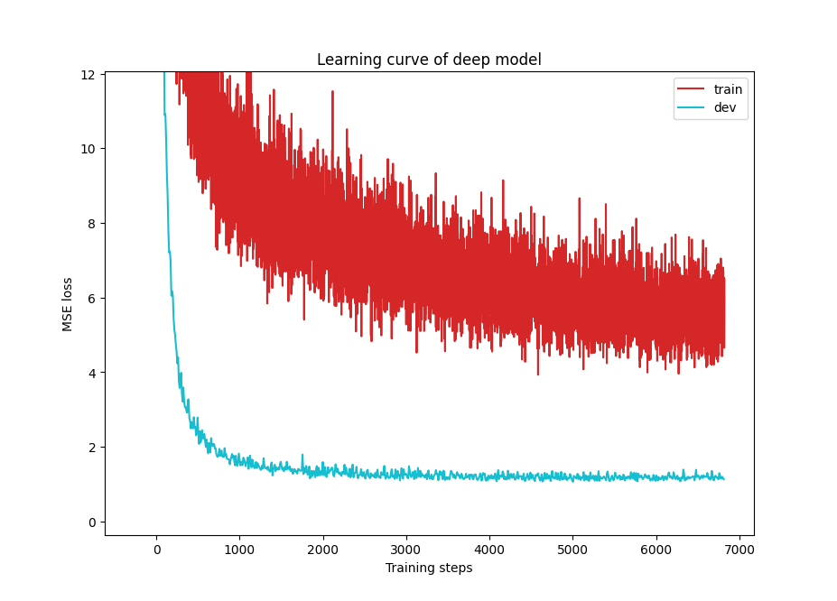

# 作业总结

## HW1

作业提示中提到了三个不同难度的基线（Baseline），这为你提供了清晰的步骤：

- **简单基线 (Simple Baseline)**
  - **任务**：直接运行 `HW01.ipynb` 中提供的示例代码，不做任何修改。这会产生一个基础的预测结果。
- **中等基线 (Medium Baseline)**
  - **任务**：进行**特征选择 (Feature Selection)** 。
  - **具体操作**：在 `HW01.ipynb` 的 `COVID19Dataset` 部分，你会找到一个 `TODO` 注释。根据PDF中的提示，你需要修改代码，只选择“40个州的one-hot编码”和“2个`tested_positive`相关的特征”作为模型的输入 。
- **强大基线 (Strong Baseline)**
  - **任务**：进一步优化模型以获得更好的性能。PDF和IPYNB文件中的提示指明了几个方向 ：
    - **更好的特征选择**：除了中等基线中提到的特征，是否还有其他特征对预测有帮助？
    - **调整DNN架构**：在 `NeuralNet` 类定义部分，你可以尝试增加或减少网络的层数、改变每层的维度、更换激活函数（如把ReLU换成其他函数）等 。
    - **调整训练参数**：在 `config` 字典中，你可以调整学习率（learning rate）、优化器（optimizer，如把SGD换成Adam）、批次大小（mini-batch size）等超参数 。
    - **正则化 (Regularization)**：在 `NeuralNet` 类的 `cal_loss` 函数中，你可以添加L2正则化来防止模型过拟合 。

很明显，中等基线（loss = 0.96）测试结果不如简单极限（loss < 0.8）。

### 强基线中只更改网络层数

在简单基线中，Loss是0.7480，epoch是1707，我只修改了神经网络的层数（128-64-1），为什么只有390epoch，以及Loss是0.7336，没有比单层神经网络loss提升更大

**为什么训练提前结束了？(从 1707 epoch -> 390 epoch)**

这个现象的直接原因是代码中的**“早停机制 (Early Stopping)”**。

在 `train` 函数中，有这样一段逻辑：

- 模型每完成一个epoch的训练，就会在验证集（dev set）上计算一次损失（dev_mse）。
- 程序会记录下迄今为止最低的验证集损失（`min_mse`）。
- 如果最新的验证集损失**没有比历史最低值更好**，一个计数器 `early_stop_cnt` 就会加1。
- 如果验证集损失连续 `config['early_stop']` 个epoch（在你的代码中这个值是200）都没有变得更好，程序就会认为训练已经达到了瓶颈，再继续下去也没有意义（甚至可能开始过拟合），于是**主动停止训练**。

**为什么你的新模型停得更早？**

因为你把神经网络改得更深（`128-64-1`），**模型的学习能力和效率变得更强了**。

- **简单模型（单层）**：就像一个初学者，需要反复看很多遍（1707个epoch）才能慢慢找到规律，达到它的性能极限。
- **复杂模型（多层）**：像一个更聪明的学生，能更快地从数据中提取复杂的模式。它可能在第190个epoch左右（390 - 200 = 190）就已经达到了验证集上的最佳表现。在那之后，又继续训练了200个epoch，但验证集损失一直没能再创新低，于是触发了早停机制。

**结论**：训练提前结束是一个**好迹象**，说明你的新模型更强大，学习效率更高。

**为什么Loss提升不明显？(从 0.7480 -> 0.7336)**

虽然模型更强大了，但性能提升却很小，这通常由以下几个原因造成：

a) 数据本身的限制和噪声

这是最常见的原因。模型性能的上限最终是由数据质量决定的。你提供的特征（即使是全部93个）可能不足以完美预测确诊率，数据中存在一些固有的、无法被模型学习的随机性或“噪声”。你的模型可能已经非常接近这个数据能达到的最佳性能了，所以即使增强模型，提升空间也非常有限。

b) 超参数需要同步优化

你只改变了模型的结构，但**训练模型的方法（超参数）**并没有改变。一个更复杂的模型通常需要一套不同的、更精细的超参数来配合。

- **学习率（Learning Rate）**：对于一个更复杂的模型，原来对简单模型来说合适的学习率可能就**太大了**。这会导致模型在最优点附近“来回震荡”，而无法精确地收敛到最低点。
- **优化器（Optimizer）**：`SGD` 是一个基础的优化器，而像 `Adam` 这样的自适应优化器通常在处理复杂模型时表现更好，能更稳定地找到最优解。

c) 模型开始过拟合

一个更强大的模型虽然学得快，但也更容易“用力过猛”，即开始学习训练数据中的噪声，而不是通用的规律。虽然早停机制在一定程度上抑制了过拟合，但在它停止的时候，模型可能已经处于轻微过拟合的边缘了。这表现为它在训练集上表现极好，但在没见过的验证集上提升却不大。

###　更改网络层数继续修改了dropout和正则化

当然，我们来详细解释一下 L2 正则化和 Dropout 这两个强大的技术，以及你 `config` 文件中的动量（momentum）参数。

**L2 正则化 (L2 Regularization)**

通俗解释：

想象一下，你的神经网络模型在学习时，可能会“用力过猛”。具体表现为，模型可能会过度依赖某几个特征，导致这些特征对应的权重（weights）变得非常大。一个权重很大的模型会非常复杂，对训练数据中的微小扰动都非常敏感，这就会导致过拟合——即模型在训练集上表现完美，但在没见过的测试集上表现很差。

L2 正则化就是给模型增加一个“纪律约束”。它告诉模型：“你可以学习，但尽量不要让任何一个权重变得过大。如果你非要用大权重，我就会在你的总分（损失函数）上给你一个惩罚。”

技术原理：

L2 正则化通过在原来的损失函数（比如均方误差MSE）后面，加上一个“惩罚项”来实现。这个惩罚项是模型所有权重值的平方和，再乘以一个系数λ (lambda)。

```
新的总损失 = 原始损失 + λ * (所有权重的平方和)
```

- **权重越大，平方后的值会不成比例地暴增**，导致惩罚也越大。
- 这会迫使优化器在最小化原始损失的同时，也要努力让权重值保持小而分散。
- 最终，模型会倾向于使用所有特征的较小权重，而不是依赖少数特征的较大权重，从而变得更简单、更稳定，泛化能力更好。

在你的 config 中：

'weight_decay': 1e-5 就是 L2 正则化。在深度学习框架中，“权重衰减(Weight Decay)”通常就是指 L2 正则化。你设置的 1e-5 就是那个惩罚系数λ，它控制着正则化的强度。

 **Dropout (随机失活)**

通俗解释：

Dropout 是另一种非常有效的防止过拟合的技术。它的想法简单而巧妙：在训练模型的过程中，随机地让一些神经元“临时罢工”。

想象一个团队在做一个项目。如果每次开会所有人都到齐，可能会出现一些人依赖特定“明星员工”的情况，自己就不动脑子了（这叫“协同适应 Co-adaptation”）。现在我们引入 Dropout 机制：每次开会，随机让一些人“请假”。这样一来：

- 没有任何一个成员是永远可靠的。
- 为了完成任务，每个成员都必须学会独立工作，变得更强大、更“全能”。

技术原理：

在神经网络的每一次训练迭代中，Dropout 层会以一定的概率（比如50%）随机地将当前层的一些神经元的输出设置为零。

- 这意味着这些“罢工”的神经元在这一次的前向传播和反向传播中都不起作用。
- 由于每次“罢工”的神经元组合都不同，模型实际上等于在训练成千上万个不同的、更小的子网络。
- 这强迫网络不能过度依赖任何一个神经元，必须学习到更鲁棒、更通用的特征。
- 在最终**预测（测试）时，所有神经元都会恢复工作**，不会再有神经元被丢弃。

**关于你的 `config` 和动量 (Momentum)**

```py
'optim_hparas': { 
    'lr': 0.0001, 
    'momentum': 0.9, 
    'weight_decay': 1e-5 
},
```

问： 我的 config 中添加了动量，没问题吧？

答： 完全没问题，而且这是非常好的实践！

- 动量 (Momentum) 是什么？

  动量是 SGD（随机梯度下降）优化器的一个改进。标准的 SGD 就像一个盲人下山，每一步都只朝着当前最陡峭的方向走一小步，容易走弯路或者卡在某个小坑里（局部最小值）。

  动量给这个盲人增加了一个“惯性”。它会累积过去几步的方向，使得当前的前进方向不仅取决于当前最陡峭的方向，还受到过去前进方向的影响。

  - **优点1：加速收敛**。如果连续几步的方向都差不多，动量会累积，使得下降速度越来越快。
  - **优点2：冲出局部最优**。当陷入一个平坦区域或者一个很浅的局部最优“小坑”时，惯性可以帮助它“冲”出去，继续寻找更好的全局最优解。

结论：

SGD + Momentum 是一个非常经典且强大的优化器组合。你同时使用动量（momentum）来加速和优化训练过程，并使用权重衰减（weight_decay，即L2正则化）来防止模型过拟合，这是一个非常标准且有效的配置。

**为什么我在增加了L2和dropout之后，训练和测试Loss的分布会这么奇怪，而且也只是执行了557个epoch，loss也到了1.0661，远不如只增加网络层数的效果。**



这是一个非常经典和有价值的现象！你的实验结果和困惑，恰好触及了机器学习中一个最核心的概念：**在“欠拟合”与“过拟合”之间寻找平衡点**。

我们先来分析你的结果图，再解释背后的原因。

结果分析

**1. “奇怪”的学习曲线 (`loss_增加网络层数以及dropout和L2.png`)**

你观察到训练损失（红线）大部分时间都**高于**验证损失（蓝绿色线），这看起来很反常，但**这恰恰是 Dropout 机制在起作用的典型特征**。

- **训练时**：Dropout 层被激活，网络中50%的神经元被随机“关闭”。模型等于是在一个“残缺”的状态下学习，任务变得更困难，所以训练损失会偏高。
- **验证时**：Dropout 层被关闭，所有神经元都参与工作。模型恢复到“全力”状态来做预测，因此它在验证集上的表现（损失）反而会比在“残缺”状态下训练时的表现更好。

所以，这个曲线形状本身是正常的。**真正的问题不是曲线的形状，而是两条线最终收敛到的位置太高了（Loss > 1.0）**。

**2. 糟糕的预测效果 (`GT&Prd...1.06.png`)**

对比只增加网络层数的结果（下图），你会发现这张图里的红点云团**极其散乱**，几乎看不出与代表完美预测的蓝线有任何明显的相关性。这直观地说明，你的模型基本没学到什么有效的规律。

**核心原因：从“过拟合”的风险，走向了“欠拟合”的极端**

L2 正则化和 Dropout 都是防止**过拟合（Overfitting）**的强大工具，好比是给模型套上了“缰绳”，防止它在训练数据上“跑得太野”。

- **过拟合**：模型过于复杂，学习了太多训练数据的噪声，导致在测试集上表现不佳。
- **欠拟合（Underfitting）**：模型过于简单，或者被限制得太死，连训练数据中的基本规律都无法学好。

在你这次的实验中，你同时使用了两种强力的“缰绳”：

1. **两个 `Dropout(0.5)` 层**：每次训练都随机丢弃掉一半的神经元，这是一个非常强的约束。
2. **L2 正则化 (`weight_decay`)**：惩罚所有过大的权重。

**结论就是：你对模型的正则化“用力过猛”了，导致了“过度正则化 (Over-regularization)”，从而使模型陷入了“欠拟合 (Underfitting)”的状态。**

你的模型就像一个被“缰绳”勒得太紧的学霸，他生怕自己会死记硬背（过拟合），所以干脆什么都不记了，结果连最基本的公式都忘了（欠拟合），最后在训练集和测试集上都考得很差。

这也是为什么训练提前结束（557个epoch）并且最终损失很高的原因——模型被限制得太厉害，根本学不动了，很早就达到了它在这种强约束下的性能极限，于是触发了早停机制。

解决方案与下一步建议

你的目标是在“不戴缰绳到处乱跑”（可能过拟合）和“勒得动弹不得”（欠拟合）之间，找到一个完美的平衡点。

**你需要做的是：减弱正则化的强度！**

建议你按照下面的顺序尝试，并且**每次只改动一个参数**，这样才能清晰地看到是哪个改动带来了效果：

1. **大幅降低 Dropout 率**：这是最关键的一步。`0.5` 的丢弃率非常高。你可以尝试把它降到 `0.2` 或 `0.25`。

   Python

   ```
   nn.Dropout(0.2)
   ```

2. **降低 L2 正则化强度**：减小 `weight_decay` 的值，比如从 `1e-5` 改为 `1e-6`，或者暂时先把它设为`0`，只看 Dropout 的效果。

3. **减少 Dropout 层的数量**：可以先只保留一个 Dropout 层，而不是两个都用。

推荐的第一个尝试：

保持 L2 不变 (weight_decay=1e-5)，然后将两个 Dropout 层的丢弃率都从 0.5 改为 0.2。然后再次运行训练，观察你的学习曲线和最终的损失值，很可能会有显著的改善。

### 什么是 Adam 优化器？

Adam (Adaptive Moment Estimation) 优化器可以被看作是两种经典优化器思想的集大成者：**Momentum** 和 **RMSprop**。你已经很熟悉 Momentum 了，我们再加入 RMSprop 的概念。

1. **动量 (Momentum)**：
   - **作用**：引入“惯性”来加速训练和穿越平坦区域或局部最优的小坑 。它通过累积过去梯度的方向来帮助当前梯度的更新。
   - **核心思想**：为所有参数提供一个统一的“加速度”。
2. **RMSprop (Root Mean Square Propagation)**：
   - **作用**：为**每一个参数**自适应地调整学习率。
   - **核心思想**：它会跟踪每个参数梯度的“历史大小”（具体来说是梯度平方的移动平均值）。
     - 对于梯度一直很大的参数（说明它在一个很陡峭的区域），RMSprop 会**减小**它的学习率，让它走得慢一点，以防“冲过头”。
     - 对于梯度一直很小的参数（说明它在一个很平坦的区域），RMSprop 会**增大**它的学习率，让它走得快一点，以加速收敛。

**Adam = Momentum + RMSprop**

Adam 优化器巧妙地将这两者的优点结合了起来：

- 它像 **Momentum** 一样，会计算梯度的一阶矩估计（即梯度的平均值），这保留了“惯性”以加速训练。
- 它像 **RMSprop** 一样，会计算梯度的二阶矩估计（即梯度平方的平均值），这使得它能为**每一个参数**都计算出一个自适应的学习率。

简单来说，**Adam 不仅像 `SGD+Momentum` 那样有一个全局的“惯性”帮助它冲得更快，还为每个参数都配备了一个独立的“油门”，可以根据路况（参数的梯度大小）自动调整速度，陡峭的地方减速慢行，平坦的地方加速通过。**

**为什么 Adam 会进一步优化你的结果？**

虽然你已经为 `SGD+Momentum` 精心找到了一个全局最优的学习率 `0.0005`，但这个学习率对于模型中**所有**的93个特征（以及成千上万个权重参数）来说都是一视同仁的。

然而，在你的数据中，不同特征的重要性、尺度和更新频率很可能天差地别：

- 某些州的特征可能很快就学习到位了，不再需要大的更新。
- 而某些行为指标特征可能比较稀疏或难以学习，需要更精细的调整。

这时，Adam 的优势就体现出来了：

1. **自适应学习率 (Adaptive Learning Rate)**：`SGD` 对所有参数都使用相同的学习率，而 `Adam` 能给那些“学习困难”或梯度较小的参数分配一个相对较大的学习率，同时给那些梯度已经很大的参数分配一个较小的学习率。这种“因材施教”的方式使得整体的优化路径更高效，能找到 `SGD` 可能错过的一些更深、更精细的最小值点。
2. **鲁棒性和易用性 (Robustness and Ease of Use)**：Adam 通常对初始学习率的选择不如 `SGD` 那么敏感。因为它能自我调整，所以即使初始学习率不是绝对最优，它也能在训练过程中进行修正。这使得它在很多任务中都能快速地达到一个非常好的结果，是目前深度学习领域的“首选默认优化器”之一。

### 总结

我用Adam优化器时，将参数做了如下调整，找到了非常极限的最优loss:0.7057，比其他参数和其他优化方法低了0.05左右。

```py
config = {
    'n_epochs': 3000,  # 最大训练轮数
    'batch_size': 270,  # 数据加载器的小批次大小
    'optimizer': 'Adam',  # 优化算法（torch.optim中的优化器）
    'optim_hparas': {  # 优化器的超参数（取决于使用的优化器）
        'lr': 0.0007,  # SGD的学习率
        # 'momentum': 0.9,  # SGD的动量
        'weight_decay': 7e-6  # SGD的权重衰减
    },
    'early_stop': 200,  # 早停轮数（模型最后一次改进后的轮数）
    'save_path': 'models/model.pth'  # 模型保存路径
}
```

