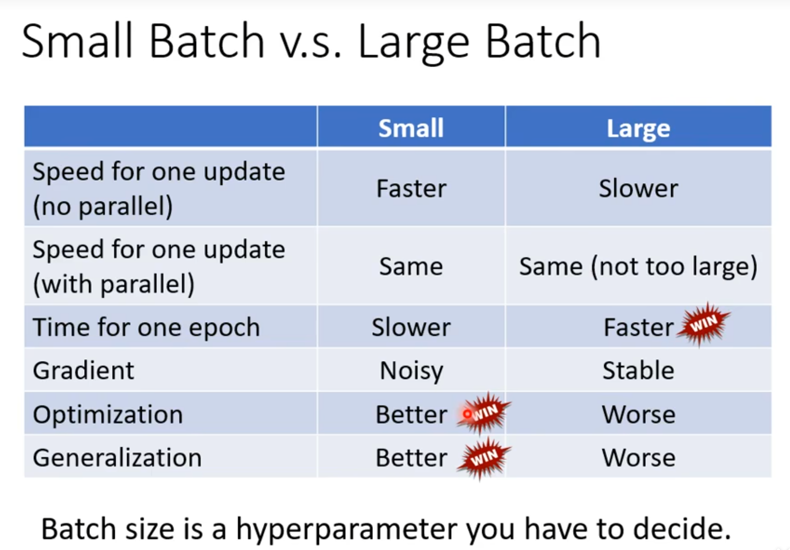

# MLNote

## 基本概念

ML本质是一个将一个东西转化为另一个东西的方程

### 不同机器学习的类型

**Regression**：这个方程输出一个数值

**Classification**：这个方程输入固定的选项，输出正确值

例如阿尔法狗，从19*19选一个正确的选项

**Structured Learning**：生成一个有结构的东西，例如文章和代码

### 流程讲解

#### 1. 有未知参数的函数

模型是一个带有未知参数的方程

输入的已知参数叫feature，乘在feature前面的叫权重（weight），额外加的参数叫偏置（bias）

#### 2. 从训练数定义损失含函数

损失函数（LOSS）：是一个参数方程，输出值能够体现一组输入值（b,w）的好坏

每一次记录的数据都用写好的方程计算和真实数据的差值的绝对值（或者差值平方）称为error值，将所有error值进行计算便可以得到损失函数

#### 3. 最佳化（Optimization）

计算所有参数的损失函数后，需要找到Loss最小的参数
$$
w^*, b^* = arg\underset{w,b}{\min}L
$$
如何找到Loss最小，需要使用**梯度下降（Gradient Descent）**。就是计算偏导数那个东西

假设Loss只跟w一个参数有关系，随机选了一个$w_0$，计算这一点的导数，当导数为负时则要增加w，当导数为正时要减小w。

增加和减小w的值有两个东西决定：第一个是斜率大小，第二个是**η参数（学习速率，learning Rate）**。

学习速率你需要自己设定其大小。这种做机器学习中需要自己设定的东西叫**hyperparameters（超参数）**

你需要计算好下一个w的值：
$$
w_n = w_{n-1} - \eta \frac{\partial L}{\partial w} \Big|_{w = w_0}
$$

但是梯度下降只能找到**局部最小值**（极值）不能找到**全局最小值**，之后再探讨这个问题。

同理，有两个参数时，就需要计算偏导数（程序自动帮你算）。

若数据呈现周期性，则需要把方程适当调整。

 **model bias**：我们的线性模型总不会匹配真实的数据趋势，这个问题叫model bias

### sigmoid

事实上，一个波动的数据可以看做由多个三段折线构成

上面蓝色方程的要如何表达呢？用**Sigmoid**曲线逼近，叫做**Hard Sigmoid**
$$
y = c \frac{1}{1 + e^{-(b+wx_1)}} \\ = c \text{ sigmoid}(b+wx_1)
$$

可以将线性回归转化为有sigmoid的公式：

拓展，下面公式的含义
$$
y = b + \sum_{i} c_i \text{ sigmoid} \left( b_i + \sum_j w_{ij}x_j \right)
$$
这个公式是一个常见的两层神经网络结构

举个例子（感谢Gemini）：

我在买一个房子。我可能会考虑各个隐藏非客观存在因素，例如居住舒适度（i=1），升值潜力（i=2），交通便利性（i = 3）

1. x是输入参数，例如$x_1$卧室数量，$x_2$房屋面积，$x_3$地理位置等**原始特征**。
2. w是你给上述参数提供的**权重**，更看重哪一个需求。例如$w_{i1} = 3$，$w_{i2} = 10$, $w_{i3} = 2$（w值也会随着i变化而变化）

3. $b_i$为为每一个隐藏因素给的基本得分
4. sigmoid将后面一大坨转化为在开区间(0,1)内的值
5. c是给每一个隐藏因素都乘上一个**权重**，例如居住舒适度$c_1 = 10$，升值潜力$c_2 = 1$，交通便利性$c_3 = 8$。
6. b是最终的基础得分。

上面很接近人买一套房子的**多层次思考过程**。不直接用原始数据预测结果，而是用原始数据得到了更加抽象的因素，在根据这些因素获取到了最终结果。

这个公式描述的是一个常见的**两层神经网络结构**：

- **内层求和 ($∑_j$)：** 在括号内部，这个求和是对所有输入特征 xj 进行加权求和。它表示一个神经元（或者说一个`sigmoid`激活函数）的输入。这里的 wij 是连接第 j 个输入特征到第 i 个神经元的权重。
- **外层求和 ($∑_i$)：** 这个求和是对所有神经元的输出进行加权求和。每个 `sigmoid` 函数代表一个**隐藏层神经元**。ci 是每个隐藏层神经元的输出到最终输出的权重。

这个过程和人脑的工作方式非常相似，这也是为什么这种结构（被称为**神经网络**）在处理复杂问题时非常有效。公式描述的是一个**全连接网络**的一部分，其中每个“中间神经元”都考虑了**所有**输入信息。

用数学语言表达：

用向量和矩阵语言表达（向量**r**是sigmoid里边那一堆）：

每一个sigmoid函数都是上图的蓝色function，sigmoid函数输出也简写为向量**a**

权重c也可以表示为向量 **$c^T$**，最后再加上权重

用向量和常数表示双层神经网络的公式：
$$
y = b + \mathbf{c}^T \sigma(\mathbf{b} + \mathbf{W}\mathbf{x})
$$

所有的未知参数拼起来的向量统称θ

有关于sigmoid方程计算loss：

最优化，要找到$θ^*$。需要选择一个初始向量$θ^0$，然后计算每一个未知参数对它的偏导数。所有偏导数组合到一起为梯度向量。之后再根据向量减法找出下一组$θ^1$，直至找到最优解。

**拓展：为什么梯度要做减法？因为你要找到loss的最小值，梯度的方向是函数增长最快的方向，所以需要反着找。**

梯度向量**g**是初始值（gradient）
$$
\mathbf{g} =  \begin{bmatrix} \left. \frac{\partial L}{\partial \theta_1} \right|_{\boldsymbol{\theta} = \boldsymbol{\theta}^0} \\ \left. \frac{\partial L}{\partial \theta_2} \right|_{\boldsymbol{\theta} = \boldsymbol{\theta}^0} \\ \vdots \end{bmatrix}
$$
简写为：
$$
\mathbf{g} = \nabla L(\boldsymbol{\theta}^0)
$$

做向量减法：
$$
\begin{bmatrix}
\theta_1^1 \\
\theta_2^1 \\
\vdots
\end{bmatrix}
=
\begin{bmatrix}
\theta_1^0 \\
\theta_2^0 \\
\vdots
\end{bmatrix}
-
\eta
\begin{bmatrix}
\left. \frac{\partial L}{\partial \theta_1} \right|_{\boldsymbol{\theta} = \boldsymbol{\theta}^0} \\
\left. \frac{\partial L}{\partial \theta_2} \right|_{\boldsymbol{\theta} = \boldsymbol{\theta}^0} \\
\vdots
\end{bmatrix}
$$
简写为：
$$
\boldsymbol{\theta}^1 = \boldsymbol{\theta}^0 - \eta \mathbf{g}
$$
在实际操作中，不会用所有参数只算一个Loss，随机分成了多个**batch**（一批数据）。每个batch单独计算Loss。

一个**Update**指的是一个batch的根据计算出的梯度调整未知参数的过程。

一个**epoch**（时期）指的是在模型训练中，完整地看了一遍所有的训练数据。

**所以一个epoch = 所有batch进行了一轮update**

在一个epoch过后要进行一次**Shuffle（置乱）**，再次随机生成一组batch。

sigmoid的平替：我不想用soft sigmoid把折线替代，也可以用另一种方法。

保持折线的方法：**ReLU(Rectified Linear Unit)**

 因为是两个折线合成的一个ReLU，所以需要用2i次求和。
$$
y = b + \sum_{2i}c_i \max(0, b_i + \sum_j w_{ij}x_j)
$$
**Sigmoid和ReLu统称为activation function （激活函数）**

### 为什么要分Batch

一整个数据集都放在一个batch里边叫**Full batch**

大batch每一个epoch只需要更新一次参数，但小batch每一个epoch需要更新多次参数。

注意不一定大batch更新速度就慢，小batch更新速度就慢。因为涉及到了**平行运算**，这是GPU干的活。

如下图所示，**一个大的batch反而可以节约时间。**

如下图所示，**用一个大的batch会导致loss变大**。这是**最优化**问题。

如下图所示，一种解释是小batch在一个epoch时会多次update参数，导致可能在一个batch卡在鞍点的参数在另一个batch中反而还能继续梯度下降。而大batch卡住就是卡住了。

在实际应用中，大Batch比小的Batch在测试集上差一点（训练集差不多）。即小batch比大batch**最优化**好一点。

这样的结果有一种解释：训练集得出的loss图形有一些局部最小值，这些局部最小值也分好坏。周围比较平的叫好局部最小值，周围比较波动的叫坏局部最小值。

当测试集和训练集的模式不太相同时，若参数对应的loss落在了好局部最小值则影响不大，若参数对应loss落在了坏局部最小值则会产生很大的偏差。

由于小batch会update很多次，参数及loss会随机变化，对于小batch的loss可能在sharp局部最小值很轻松的就跳出来，而大batch的loss只能比较严格的遵守梯度下降。

总结：

### 神经网络

同理，我们可以再多叠几层方程。

 神经网络并不是叠的越深越好，容易出现过拟合的现象。（多层网络反而不如浅层网络预测得好）

## 如何进行一个机器学习任务

### 当训练集loss很大时

#### 模型本身的问题（model bias）

可能是模型太简单，需要重新设定model。例如添加更多参数，以及转化为神经网络。

#### 最优化问题

梯度下降没办法找到全局最小值，只能找到局部最小值。

#### 如何判定当训练效果不佳是模型问题还是最优化问题？

 

测试集中，56层的神经网络不如20层的效果好，不叫过拟合。

训练集中，56层比20层效果还要差，这说明是模型的最优化没做好。

建议一开始选择简单的且最优化很好的模型训练。如果一个弹性更好的模型训练结果还不如简单的，那就是最优化的问题。

### 当训练集loss很小时

继续加深，越小越好。

若还是很大

#### 过拟合 Overfitting

**当训练集的Loss小，而测试集的loss大才叫过拟合。**为什么？

下图是一个极端的例子，训练集的Loss是0，测试集的loss很大

如果模型的自由度很大的话可能会导致过拟合。

如何解决过拟合？

* 增加训练集

* **数据增强（Data augmentation）**：例如在影响识别里边，把图片左右旋转放大缩小等，但也不是瞎操作，一般不能将图像上下颠倒。

#### mismatch

也可以算是overfitting，当训练资料和测试资料的分布不一样时，无论怎么增加训练集（增加训练集可以减少过拟合的问题），都没办法减小loss

### 如何选择一个在训练集和测试集Loss都很小的模型

当模型的弹性越大时，可能训练集的Loss会越来越小，但测试集的loss会变大。

找复杂的模型会有过拟合问题，找简单模型会有model bias问题。

也有可能从训练集选出的某一个很烂的模型在公共测试集上面恰好loss很低（这就是为什么训练集和测试集不能是一样的）

### 最优化失败的时候怎么办

上面讲的梯度下降方法中，当梯度为0时，loss就降不下去了

当梯度为0时，不一定是局部最小值（极值），也有可能是**saddle point(鞍点)**。**梯度为0的点统称为critical point**

例如$x^3$，当x为0时，导数值为0，但不是极值点，需要再求一次导确认。

loss卡在了局部最小值，则没有路可以走。但是如果卡在了鞍点，则还可以继续减小loss。

接下来需要判断loss被卡在哪一种情况。

#### 如何判断最优化失败时是由于局部最小值还是由于鞍点

复习线代：

1. 二次型是一个特殊的数学表达式，是一个多项式，其中所有项都是二次。
2. **海森矩阵（Hessian）**是一个由多元函数的二阶偏导数组成的矩阵。简单来说，海森矩阵**描述了损失函数在某个点附近的曲率**。它捕捉了函数在不同维度上的“弯曲”程度和方向。海森矩阵H的元素定义为

$$
H_{ij} = \frac{\partial^2 L}{\partial \theta_i \partial \theta_j}
$$

3. **正定（positive definite）**：当且仅当一个对称矩阵的所有**特征值都为正**时，它才是正定的。此时，对于所有非零向量 v，二次型 $v^THv>0$。

   **负定（negative definite）**：当且仅当一个对称矩阵的所有**特征值都为负**时，它才是负定的。此时，对于所有非零向量 v，二次型 $v^THv<0$。

   **不定**：当一个对称矩阵的特征值**有正有负**时，它是不定的。此时，二次型 $v^THv$的符号会随着向量 $v$的不同而改变。

复习泰勒展开：
$$
f(x) \approx f(a) + f'(a)(x-a) + \frac{f''(a)}{2!}(x-a)^2 + \dots
$$
注意，**θ**以及**g**都是向量。
$$
\mathbf{g} = \nabla L(\boldsymbol{\theta'})
$$

$$
g_i = \frac{\partial L(\boldsymbol{\theta'})}{\partial \theta_i}
$$

下面的公式是泰勒展开的近似（少了二阶项之后的项），用矩阵和向量语言表达。
$$
L(\boldsymbol{\theta}) \approx L(\boldsymbol{\theta'}) + (\boldsymbol{\theta} - \boldsymbol{\theta'})^T \mathbf{g} + \frac{1}{2}(\boldsymbol{\theta} - \boldsymbol{\theta'})^T \mathbf{H}(\boldsymbol{\theta} - \boldsymbol{\theta'})
$$

当一阶项为0时，通过二阶项判断这一点附近的error surface
$$
L(\boldsymbol{\theta}) \approx L(\boldsymbol{\theta'}) + \frac{1}{2}(\boldsymbol{\theta} - \boldsymbol{\theta'})^T \mathbf{H}(\boldsymbol{\theta} - \boldsymbol{\theta'})
$$

下面的部分解释了如何通过**二次型**$v^THv$ 的符号来判断点的类型。这里的向量 $v $代表从 $θ^′$ 离开的任意方向，即 $v=(θ−θ^′)$。

- **局部最小值 (Local minima)**：$H$是正定的，故 $v^THv$总大于0。无论$θ$取何值二次项总大于0，故$L(θ)$总大于$L(θ^′)$。
- **局部最大值 (Local maxima)**：$H$是负定的，故 $v^THv$总小于0。无论$θ$取何值二次项总小于0，故$L(θ)$总小于$L(θ^′)$。
- **鞍点 (Saddle point)**：$v^THv$不固定正负，故$L(θ)$和$L(θ^′)$不一定谁大谁小。

在梯度为零的临界点，通过检查**海森矩阵的特性**，我们可以准确地判断这个点是**局部最小值**、**局部最大值**，还是**鞍点**。

 例子：

当$w_1$和$w_2$为0时，假设原始数据记为y-hat = 1，则会算出来这一点尽管两个偏导数为0（loss局部最小值），但其实是鞍点

海森矩阵也会告诉我们接下来应该往哪个方向找loss。

我们知道了要找到使得二次项为负的向量，让loss沿着这个向量update。上面知道了不定矩阵有负特征值，需要找到对应的**特征向量**。

拓展：为什么非要是负特征值的特征向量？

1. 特征向量代表了主曲率方向：海森矩阵的特征向量代表了损失函数在临界点处的**主曲率方向**（principal curvature directions）。这些方向是相互正交的，并且沿着这些方向，损失函数的曲率变化最为剧烈。

   * **负特征值**对应的特征向量指向损失函数**曲率最陡峭的下坡方向**。

   * **正特征值**对应的特征向量指向损失函数**曲率最陡峭的上坡方向**。

​	因此，选择负特征值对应的特征向量可以保证我们沿着**最有效的下坡路径**前进，从而更快地逃离鞍点。

2. 数学上的便利性：使用特征向量使得计算变得非常简单。

   - **通用向量**：对于任意向量 $v$，你需要计算矩阵乘法 $Hv$ 和向量内积 $v^T(Hv)$，这通常是一个复杂的计算。

   - **特征向量**：对于特征向量 $u$，计算简化为 $u^THu=u^T(λu)=λ∥u∥^2$。你只需要知道特征值 λ 和特征向量的范数 $∥u∥ $即可，这极大地简化了分析和计算。

3. 与牛顿法的联系：这种方法是**牛顿法**（Newton's Method）在非凸优化中的一种应用。标准的牛顿法通过海森矩阵的逆来更新参数：Δθ=−H−1g。在鞍点，梯度 g=0，牛顿法会停滞。

然而，当海森矩阵**不定**（有负特征值）时，我们可以利用特征分解 H=QΛQT，并修改更新规则，例如沿着负特征值对应的特征向量方向进行更新，这被称为**信赖域方法**（Trust-Region Method）等高级优化算法。这些方法正是基于对海森矩阵特征值的分析。

#### 局部最小值和鞍点哪一个更常见

这张幻灯片展示了一项**实证研究**，旨在探索在训练神经网络时，模型收敛到的**临界点**（critical point）是**鞍点**还是**局部最小值**。

图表是一个散点图，横轴是 **"Minimum Ratio"**（最小值比例），纵轴是 **"Training Loss"**（训练损失）。

- **横轴：最小值比例 (Minimum Ratio)**
  - 这个比例的定义是：`正特征值的数量 / 总特征值的数量`。
  - **如果这个比例接近 1**，意味着海森矩阵的大多数特征值都是正数，这表明该点更像一个**局部最小值**。
  - **如果这个比例远小于 1**，意味着海森矩阵有许多负特征值，这表明该点更像一个**鞍点**。
- **纵轴：训练损失 (Training Loss)**
  - 这表示模型在收敛到这个临界点时的损失函数值。

这张幻灯片的核心结论是：

1. 在神经网络训练中，优化器通常会收敛到**损失值较低**的临界点。
2. 这些损失值较低的临界点通常不是“纯粹”的局部最小值（即所有特征值都为正），而是一些**“很像”局部最小值**的点，因为它们的“最小值比例”非常接近 1。
3. 幻灯片上的文字指出：“**never reach a real local minima'**”，这暗示在实践中，模型可能永远不会找到一个完美的局部最小值（所有特征值都严格为正），而是找到一个**几乎所有方向都向上**的“平坦”区域。

这项实证研究支持了一个重要的观点：在**高维空间**中，**鞍点**比真正的局部最小值要常见得多。然而，优化算法（如梯度下降）在训练神经网络时，倾向于避开高损失值的鞍点，并收敛到损失值较低、更接近局部最小值的区域，这些区域可能有一些小的负曲率（即少量负特征值），但总体表现良好。

#### Momentum(动量)

若loss卡在了近似平坦的区域、鞍点以及局部最小值应该怎么办?

类似物理学中的球体沿着不规则斜面滚下去，也许可以冲出上面这些情况。

普通的梯度下降（Vanilla Gradient Descent）：沿着梯度的反方向调整参数

**Gradient Descent + Momentum**：每一步要变化的向量不只是这一点梯度的反方向向量，而是梯度反方向向量和上一步向量的和。
$$
\theta^n = \theta^{i-1} + m^{i},\space\space\space\space\space m^{i}=\lambda m^{i-1} -\eta g^{i-1}
$$

经过数学公式的转化，可以归纳成另一种方程：
$$
m^1 = \lambda m^0 - \eta g^0 = -\eta g^0 \\
m^2 = \lambda m^1 - \eta g^1 = -\lambda\eta g^0 - \eta g^1\\
m^3 = \lambda m^2 - \eta g^2 = -\lambda^2\eta g^0 - \lambda\eta g^1 - \eta g^2\\
\vdots \\
m^i = -\eta g^{i-1} - \lambda\eta g^{i-2} - \lambda^2\eta g^{i-3} - \dots - \lambda^{i-1}\eta g^0 \\
= -\eta \sum_{j=0}^{i-1} \lambda^{i-1-j} g^j
$$
这个方程的意思是本次的梯度的变化和前面所有梯度的变化都有关联。

如下图所示，即使在梯度为零的局部最小值点，也可以借助上一步的向量逃离被卡住的困境。

