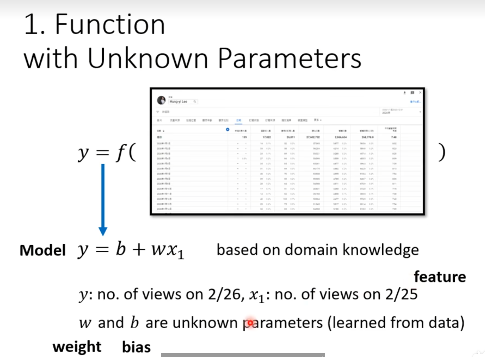

# MLNote

## 基本概念

ML本质是一个将一个东西转化为另一个东西的方程

### 不同机器学习的类型

**Regression**：这个方程输出一个数值

**Classification**：这个方程输入固定的选项，输出正确值

例如阿尔法狗，从19*19选一个正确的选项

**Structured Learning**：生成一个有结构的东西，例如文章和代码

### 流程讲解

#### 1. 有未知参数的函数

模型是一个带有未知参数的方程

输入的已知参数叫feature，乘在feature前面的叫权重（weight），额外加的参数叫偏置（bias）

#### 2. 从训练数定义损失含函数

损失函数（LOSS）：是一个参数方程，输出值能够体现一组输入值（b,w）的好坏

每一次记录的数据都用写好的方程计算和真实数据的差值的绝对值（或者差值平方）称为error值，将所有error值进行计算便可以得到损失函数

#### 3. 最佳化（Optimization）

计算所有参数的损失函数后，需要找到Loss最小的参数
$$
w^*, b^* = arg\underset{w,b}{\min}L
$$
如何找到Loss最小，需要使用**梯度下降（Gradient Descent）**。就是计算偏导数那个东西

假设Loss只跟w一个参数有关系，随机选了一个$w_0$，计算这一点的导数，当导数为负时则要增加w，当导数为正时要减小w。

增加和减小w的值有两个东西决定：第一个是斜率大小，第二个是**η参数（学习速率，learning Rate）**。

学习速率你需要自己设定其大小。这种做机器学习中需要自己设定的东西叫**hyperparameters（超参数）**

你需要计算好下一个w的值：
$$
w_n = w_{n-1} - \eta \frac{\partial L}{\partial w} \Big|_{w = w_0}
$$

但是梯度下降只能找到**局部最小值**（极值）不能找到**全局最小值**，之后再探讨这个问题。

同理，有两个参数时，就需要计算偏导数（程序自动帮你算）。

若数据呈现周期性，则需要把方程适当调整。

 **model bias**：我们的线性模型总不会匹配真实的数据趋势，这个问题叫model bias

### sigmoid

事实上，一个波动的数据可以看做由多个三段折线构成

上面蓝色方程的要如何表达呢？用**Sigmoid**曲线逼近，叫做**Hard Sigmoid**
$$
y = c \frac{1}{1 + e^{-(b+wx_1)}} \\ = c \text{ sigmoid}(b+wx_1)
$$

可以将线性回归转化为有sigmoid的公式：

拓展，下面公式的含义
$$
y = b + \sum_{i} c_i \text{ sigmoid} \left( b_i + \sum_j w_{ij}x_j \right)
$$
这个公式是一个常见的两层神经网络结构

举个例子（感谢Gemini）：

我在买一个房子。我可能会考虑各个隐藏非客观存在因素，例如居住舒适度（i=1），升值潜力（i=2），交通便利性（i = 3）

1. x是输入参数，例如$x_1$卧室数量，$x_2$房屋面积，$x_3$地理位置等**原始特征**。
2. w是你给上述参数提供的**权重**，更看重哪一个需求。例如$w_{i1} = 3$，$w_{i2} = 10$, $w_{i3} = 2$（w值也会随着i变化而变化）

3. $b_i$为为每一个隐藏因素给的基本得分
4. sigmoid将后面一大坨转化为在开区间(0,1)内的值
5. c是给每一个隐藏因素都乘上一个**权重**，例如居住舒适度$c_1 = 10$，升值潜力$c_2 = 1$，交通便利性$c_3 = 8$。
6. b是最终的基础得分。

上面很接近人买一套房子的**多层次思考过程**。不直接用原始数据预测结果，而是用原始数据得到了更加抽象的因素，在根据这些因素获取到了最终结果。

这个公式描述的是一个常见的**两层神经网络结构**：

- **内层求和 ($∑_j$)：** 在括号内部，这个求和是对所有输入特征 xj 进行加权求和。它表示一个神经元（或者说一个`sigmoid`激活函数）的输入。这里的 wij 是连接第 j 个输入特征到第 i 个神经元的权重。
- **外层求和 ($∑_i$)：** 这个求和是对所有神经元的输出进行加权求和。每个 `sigmoid` 函数代表一个**隐藏层神经元**。ci 是每个隐藏层神经元的输出到最终输出的权重。

这个过程和人脑的工作方式非常相似，这也是为什么这种结构（被称为**神经网络**）在处理复杂问题时非常有效。公式描述的是一个**全连接网络**的一部分，其中每个“中间神经元”都考虑了**所有**输入信息。

用数学语言表达：

用向量和矩阵语言表达（向量**r**是sigmoid里边那一堆）：

每一个sigmoid函数都是上图的蓝色function，sigmoid函数输出也简写为向量**a**

权重c也可以表示为向量 **$c^T$**，最后再加上权重

用向量和常数表示双层神经网络的公式：
$$
y = b + \mathbf{c}^T \sigma(\mathbf{b} + \mathbf{W}\mathbf{x})
$$

所有的未知参数拼起来的向量统称θ

有关于sigmoid方程计算loss：

最优化，要找到$θ^*$。需要选择一个初始向量$θ^0$，然后计算每一个未知参数对它的偏导数。所有偏导数组合到一起为梯度向量。之后再根据向量减法找出下一组$θ^1$，直至找到最优解。

**拓展：为什么梯度要做减法？因为你要找到loss的最小值，梯度的方向是函数增长最快的方向，所以需要反着找。**

梯度向量**g**是初始值（gradient）
$$
\mathbf{g} =  \begin{bmatrix} \left. \frac{\partial L}{\partial \theta_1} \right|_{\boldsymbol{\theta} = \boldsymbol{\theta}^0} \\ \left. \frac{\partial L}{\partial \theta_2} \right|_{\boldsymbol{\theta} = \boldsymbol{\theta}^0} \\ \vdots \end{bmatrix}
$$
简写为：
$$
\mathbf{g} = \nabla L(\boldsymbol{\theta}^0)
$$

做向量减法：
$$
\begin{bmatrix}
\theta_1^1 \\
\theta_2^1 \\
\vdots
\end{bmatrix}
=
\begin{bmatrix}
\theta_1^0 \\
\theta_2^0 \\
\vdots
\end{bmatrix}
-
\eta
\begin{bmatrix}
\left. \frac{\partial L}{\partial \theta_1} \right|_{\boldsymbol{\theta} = \boldsymbol{\theta}^0} \\
\left. \frac{\partial L}{\partial \theta_2} \right|_{\boldsymbol{\theta} = \boldsymbol{\theta}^0} \\
\vdots
\end{bmatrix}
$$
简写为：
$$
\boldsymbol{\theta}^1 = \boldsymbol{\theta}^0 - \eta \mathbf{g}
$$
在实际操作中，不会用所有参数只算一个Loss，随机分成了多个**batch**（一批数据）。每个batch单独计算Loss。

一个**Update**指的是一个batch的根据计算出的梯度调整未知参数的过程。

一个**epoch**（时期）指的是在模型训练中，完整地看了一遍所有的训练数据。

**所以一个epoch = 所有batch进行了一轮update**

sigmoid的平替：我不想用soft sigmoid把折线替代，也可以用另一种方法。

保持折线的方法：**ReLU(Rectified Linear Unit)**

 因为是两个折线合成的一个ReLU，所以需要用2i次求和。
$$
y = b + \sum_{2i}c_i \max(0, b_i + \sum_j w_{ij}x_j)
$$
**Sigmoid和ReLu统称为activation function （激活函数）**

### 神经网络

同理，我们可以再多叠几层方程。

 神经网络并不是叠的越深越好，容易出现过拟合的现象。（多层网络反而不如浅层网络预测得好）

## 如何进行一个机器学习任务

### 当训练集loss很大时

#### 模型本身的问题（model bias）

可能是模型太简单，需要重新设定model。例如添加更多参数，以及转化为神经网络。

#### 最优化问题

梯度下降没办法找到全局最小值，只能找到局部最小值。

#### 如何判定当训练效果不佳是模型问题还是最优化问题？

 

测试集中，56层的神经网络不如20层的效果好，不叫过拟合。

训练集中，56层比20层效果还要差，这说明是模型的最优化没做好。

建议一开始选择简单的且最优化很好的模型训练。如果一个弹性更好的模型训练结果还不如简单的，那就是最优化的问题。

### 当训练集loss很小时

继续加深，越小越好。

若还是很大

#### 过拟合 Overfitting

**当训练集的Loss小，而测试集的loss大才叫过拟合。**为什么？

下图是一个极端的例子，训练集的Loss是0，测试集的loss很大

如果模型的自由度很大的话可能会导致过拟合。

如何解决过拟合？

* 增加训练集

* **数据增强（Data augmentation）**：例如在影响识别里边，把图片左右旋转放大缩小等，但也不是瞎操作，一般不能将图像上下颠倒。

#### mismatch

也可以算是overfitting，当训练资料和测试资料的分布不一样时，无论怎么增加训练集（增加训练集可以减少过拟合的问题），都没办法减小loss

### 如何选择一个在训练集和测试集Loss都很小的模型

当模型的弹性越大时，可能训练集的Loss会越来越小，但测试集的loss会变大。

找复杂的模型会有过拟合问题，找简单模型会有model bias问题。

也有可能从训练集选出的某一个很烂的模型在公共测试集上面恰好loss很低（这就是为什么训练集和测试集不能是一样的）

