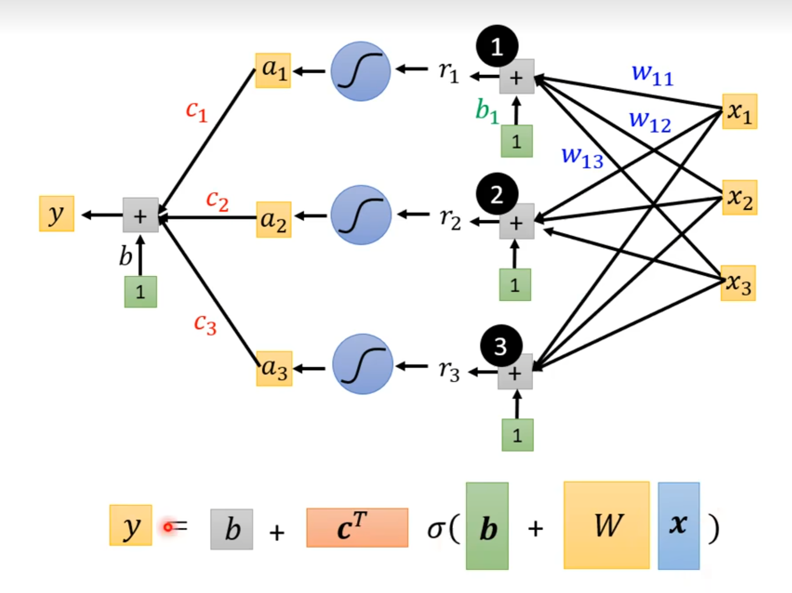
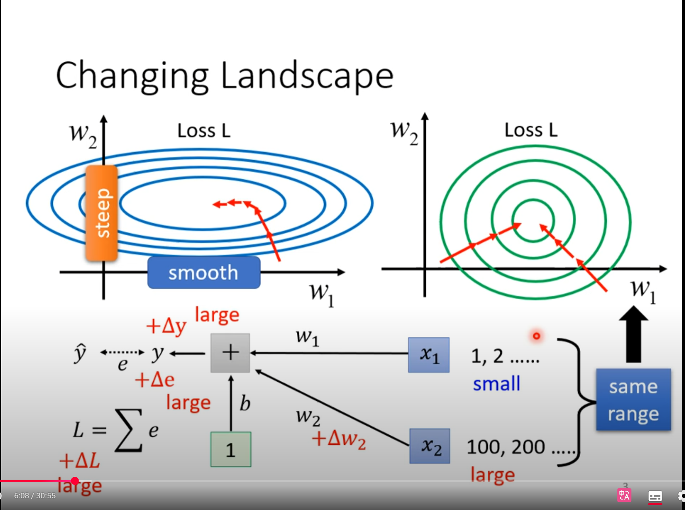
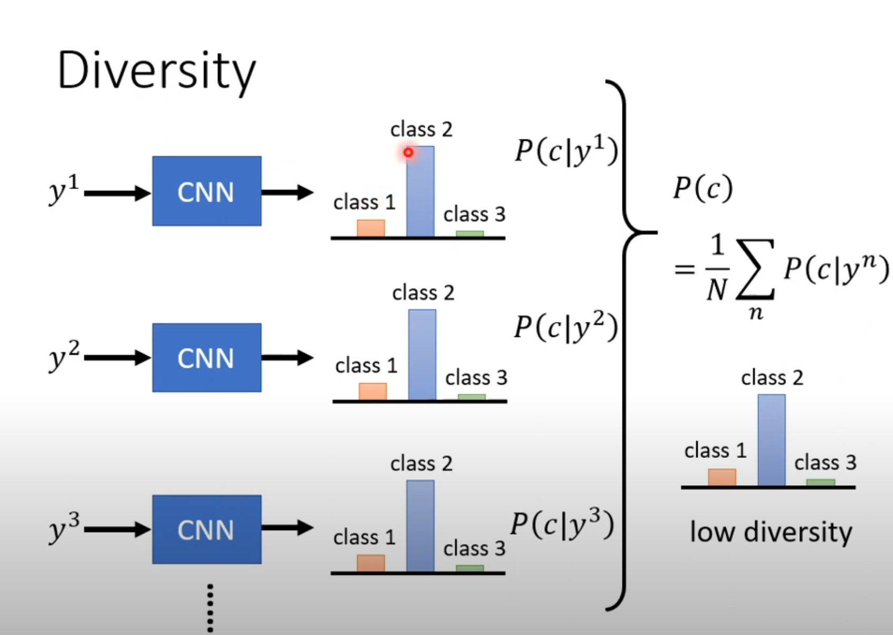

# MLNote

## 基本概念

ML本质是一个将一个东西转化为另一个东西的方程

### 不同机器学习的类型

**回归 Regression**：这个方程输出一个数值

**分类 Classification**：这个方程输入固定的选项，输出正确值

例如阿尔法狗，从19*19选一个正确的选项

**Structured Learning**：生成一个有结构的东西，例如文章和代码

### 流程讲解

#### 1. 有未知参数的函数

模型是一个带有未知参数的方程

输入的已知参数叫feature，乘在feature前面的叫权重（weight），额外加的参数叫偏置（bias）

#### 2. 从训练数定义损失含函数

损失函数（LOSS）：是一个参数方程，输出值能够体现一组输入值（b,w）的好坏

每一次记录的数据都用写好的方程计算和真实数据的差值的绝对值（或者差值平方）称为error值，将所有error值进行计算便可以得到损失函数

#### 3. 最佳化（Optimization）

计算所有参数的损失函数后，需要找到Loss最小的参数
$$
w^*, b^* = arg\underset{w,b}{\min}L
$$
如何找到Loss最小，需要使用**梯度下降（Gradient Descent）**。就是计算偏导数那个东西

假设Loss只跟w一个参数有关系，随机选了一个$w_0$，计算这一点的导数，当导数为负时则要增加w，当导数为正时要减小w。

增加和减小w的值有两个东西决定：第一个是斜率大小，第二个是**η参数（学习速率，learning Rate）**。

学习速率你需要自己设定其大小。这种做机器学习中需要自己设定的东西叫**hyperparameters（超参数）**

你需要计算好下一个w的值：
$$
w_n = w_{n-1} - \eta \frac{\partial L}{\partial w} \Big|_{w = w_0}
$$

但是梯度下降只能找到**局部最小值**（极值）不能找到**全局最小值**，之后再探讨这个问题。

同理，有两个参数时，就需要计算偏导数（程序自动帮你算）。

若数据呈现周期性，则需要把方程适当调整。

 **model bias**：我们的线性模型总不会匹配真实的数据趋势，这个问题叫model bias

### sigmoid

事实上，一个波动的数据可以看做由多个三段折线构成

上面蓝色方程的要如何表达呢？用**Sigmoid**曲线逼近，叫做**Hard Sigmoid**
$$
y = c \frac{1}{1 + e^{-(b+wx_1)}} \\ = c \text{ sigmoid}(b+wx_1)
$$

可以将线性回归转化为有sigmoid的公式：

拓展，下面公式的含义
$$
y = b + \sum_{i} c_i \text{ sigmoid} \left( b_i + \sum_j w_{ij}x_j \right)
$$
这个公式是一个常见的两层神经网络结构

举个例子（感谢Gemini）：

我在买一个房子。我可能会考虑各个隐藏非客观存在因素，例如居住舒适度（i=1），升值潜力（i=2），交通便利性（i = 3）

1. x是输入参数，例如$x_1$卧室数量，$x_2$房屋面积，$x_3$地理位置等**原始特征**。
2. w是你给上述参数提供的**权重**，更看重哪一个需求。例如$w_{i1} = 3$，$w_{i2} = 10$, $w_{i3} = 2$（w值也会随着i变化而变化）

3. $b_i$为为每一个隐藏因素给的基本得分
4. sigmoid将后面一大坨转化为在开区间(0,1)内的值
5. c是给每一个隐藏因素都乘上一个**权重**，例如居住舒适度$c_1 = 10$，升值潜力$c_2 = 1$，交通便利性$c_3 = 8$。
6. b是最终的基础得分。

上面很接近人买一套房子的**多层次思考过程**。不直接用原始数据预测结果，而是用原始数据得到了更加抽象的因素，在根据这些因素获取到了最终结果。

这个公式描述的是一个常见的**两层神经网络结构**：

- **内层求和 ($∑_j$)：** 在括号内部，这个求和是对所有输入特征 xj 进行加权求和。它表示一个神经元（或者说一个`sigmoid`激活函数）的输入。这里的 wij 是连接第 j 个输入特征到第 i 个神经元的权重。
- **外层求和 ($∑_i$)：** 这个求和是对所有神经元的输出进行加权求和。每个 `sigmoid` 函数代表一个**隐藏层神经元**。ci 是每个隐藏层神经元的输出到最终输出的权重。

这个过程和人脑的工作方式非常相似，这也是为什么这种结构（被称为**神经网络**）在处理复杂问题时非常有效。公式描述的是一个**全连接网络**的一部分，其中每个“中间神经元”都考虑了**所有**输入信息。

用数学语言表达：

用向量和矩阵语言表达（向量**r**是sigmoid里边那一堆）：

每一个sigmoid函数都是上图的蓝色function，sigmoid函数输出也简写为向量**a**

权重c也可以表示为向量 **$c^T$**，最后再加上权重

用向量和常数表示双层神经网络的公式：
$$
y = b + \mathbf{c}^T \sigma(\mathbf{b} + \mathbf{W}\mathbf{x})
$$
 

所有的未知参数拼起来的向量统称θ

有关于sigmoid方程计算loss：

最优化，要找到$θ^*$。需要选择一个初始向量$θ^0$，然后计算每一个未知参数对它的偏导数。所有偏导数组合到一起为梯度向量。之后再根据向量减法找出下一组$θ^1$，直至找到最优解。

**拓展：为什么梯度要做减法？因为你要找到loss的最小值，梯度的方向是函数增长最快的方向，所以需要反着找。**

梯度向量**g**是初始值（gradient）
$$
\mathbf{g} =  \begin{bmatrix} \left. \frac{\partial L}{\partial \theta_1} \right|_{\boldsymbol{\theta} = \boldsymbol{\theta}^0} \\ \left. \frac{\partial L}{\partial \theta_2} \right|_{\boldsymbol{\theta} = \boldsymbol{\theta}^0} \\ \vdots \end{bmatrix}
$$
简写为：
$$
\mathbf{g} = \nabla L(\boldsymbol{\theta}^0)
$$

做向量减法：
$$
\begin{bmatrix}
\theta_1^1 \\
\theta_2^1 \\
\vdots
\end{bmatrix}
=
\begin{bmatrix}
\theta_1^0 \\
\theta_2^0 \\
\vdots
\end{bmatrix}
-
\eta
\begin{bmatrix}
\left. \frac{\partial L}{\partial \theta_1} \right|_{\boldsymbol{\theta} = \boldsymbol{\theta}^0} \\
\left. \frac{\partial L}{\partial \theta_2} \right|_{\boldsymbol{\theta} = \boldsymbol{\theta}^0} \\
\vdots
\end{bmatrix}
$$
简写为：
$$
\boldsymbol{\theta}^1 = \boldsymbol{\theta}^0 - \eta \mathbf{g}
$$
在实际操作中，不会用所有参数只算一个Loss，随机分成了多个**batch**（一批数据）。每个batch单独计算Loss。

一个**Update**指的是一个batch的根据计算出的梯度调整未知参数的过程。

一个**epoch**（时期）指的是在模型训练中，完整地看了一遍所有的训练数据。

**所以一个epoch = 所有batch进行了一轮update**

在一个epoch过后要进行一次**Shuffle（置乱）**，再次随机生成一组batch。

sigmoid的平替：我不想用soft sigmoid把折线替代，也可以用另一种方法。

保持折线的方法：**ReLU(Rectified Linear Unit)**

 因为是两个折线合成的一个ReLU，所以需要用2i次求和。
$$
y = b + \sum_{2i}c_i \max(0, b_i + \sum_j w_{ij}x_j)
$$
**Sigmoid和ReLu统称为activation function （激活函数）**

### 为什么要分Batch

一整个数据集都放在一个batch里边叫**Full batch**

大batch每一个epoch只需要更新一次参数，但小batch每一个epoch需要更新多次参数。

注意不一定大batch更新速度就慢，小batch更新速度就慢。因为涉及到了**平行运算**，这是GPU干的活。

如下图所示，**一个大的batch反而可以节约时间。**

如下图所示，**用一个大的batch会导致loss变大**。这是**最优化**问题。

如下图所示，一种解释是小batch在一个epoch时会多次update参数，导致可能在一个batch卡在鞍点的参数在另一个batch中反而还能继续梯度下降。而大batch卡住就是卡住了。

在实际应用中，大Batch比小的Batch在测试集上差一点（训练集差不多）。即小batch比大batch**最优化**好一点。

这样的结果有一种解释：训练集得出的loss图形有一些局部最小值，这些局部最小值也分好坏。周围比较平的叫好局部最小值，周围比较波动的叫坏局部最小值。

当测试集和训练集的模式不太相同时，若参数对应的loss落在了好局部最小值则影响不大，若参数对应loss落在了坏局部最小值则会产生很大的偏差。

由于小batch会update很多次，参数及loss会随机变化，对于小batch的loss可能在sharp局部最小值很轻松的就跳出来，而大batch的loss只能比较严格的遵守梯度下降。

总结：

### 神经网络

同理，我们可以再多叠几层方程。

 神经网络并不是叠的越深越好，容易出现过拟合的现象。（多层网络反而不如浅层网络预测得好）

## 如何进行一个机器学习任务

### 当训练集loss很大时

#### 模型本身的问题（model bias）

可能是模型太简单，需要重新设定model。例如添加更多参数，以及转化为神经网络。

#### 最优化问题

梯度下降没办法找到全局最小值，只能找到局部最小值。

#### 如何判定当训练效果不佳是模型问题还是最优化问题？

 

测试集中，56层的神经网络不如20层的效果好，不叫过拟合。

训练集中，56层比20层效果还要差，这说明是模型的最优化没做好。

建议一开始选择简单的且最优化很好的模型训练。如果一个弹性更好的模型训练结果还不如简单的，那就是最优化的问题。

### 当训练集loss很小时

继续加深，越小越好。

若还是很大

#### 过拟合 Overfitting

**当训练集的Loss小，而测试集的loss大才叫过拟合。**为什么？

下图是一个极端的例子，训练集的Loss是0，测试集的loss很大

如果模型的自由度很大的话可能会导致过拟合。

如何解决过拟合？

* 增加训练集

* **数据增强（Data augmentation）**：例如在影响识别里边，把图片左右旋转放大缩小等，但也不是瞎操作，一般不能将图像上下颠倒。

#### mismatch

也可以算是overfitting，当训练资料和测试资料的分布不一样时，无论怎么增加训练集（增加训练集可以减少过拟合的问题），都没办法减小loss

### 如何选择一个在训练集和测试集Loss都很小的模型

当模型的弹性越大时，可能训练集的Loss会越来越小，但测试集的loss会变大。

找复杂的模型会有过拟合问题，找简单模型会有model bias问题。

也有可能从训练集选出的某一个很烂的模型在公共测试集上面恰好loss很低（这就是为什么训练集和测试集不能是一样的）

### 最优化失败的时候怎么办

上面讲的梯度下降方法中，当梯度为0时，loss就降不下去了

当梯度为0时，不一定是局部最小值（极值），也有可能是**saddle point(鞍点)**。**梯度为0的点统称为critical point**

例如$x^3$，当x为0时，导数值为0，但不是极值点，需要再求一次导确认。

loss卡在了局部最小值，则没有路可以走。但是如果卡在了鞍点，则还可以继续减小loss。

接下来需要判断loss被卡在哪一种情况。

#### 如何判断最优化失败时是由于局部最小值还是由于鞍点

复习线代：

1. 二次型是一个特殊的数学表达式，是一个多项式，其中所有项都是二次。
2. **海森矩阵（Hessian）**是一个由多元函数的二阶偏导数组成的矩阵。简单来说，海森矩阵**描述了损失函数在某个点附近的曲率**。它捕捉了函数在不同维度上的“弯曲”程度和方向。海森矩阵H的元素定义为

$$
H_{ij} = \frac{\partial^2 L}{\partial \theta_i \partial \theta_j}
$$

3. **正定（positive definite）**：当且仅当一个对称矩阵的所有**特征值都为正**时，它才是正定的。此时，对于所有非零向量 v，二次型 $v^THv>0$。

   **负定（negative definite）**：当且仅当一个对称矩阵的所有**特征值都为负**时，它才是负定的。此时，对于所有非零向量 v，二次型 $v^THv<0$。

   **不定**：当一个对称矩阵的特征值**有正有负**时，它是不定的。此时，二次型 $v^THv$的符号会随着向量 $v$的不同而改变。

复习泰勒展开：
$$
f(x) \approx f(a) + f'(a)(x-a) + \frac{f''(a)}{2!}(x-a)^2 + \dots
$$
注意，**θ**以及**g**都是向量。
$$
\mathbf{g} = \nabla L(\boldsymbol{\theta'})
$$

$$
g_i = \frac{\partial L(\boldsymbol{\theta'})}{\partial \theta_i}
$$

下面的公式是泰勒展开的近似（少了二阶项之后的项），用矩阵和向量语言表达。
$$
L(\boldsymbol{\theta}) \approx L(\boldsymbol{\theta'}) + (\boldsymbol{\theta} - \boldsymbol{\theta'})^T \mathbf{g} + \frac{1}{2}(\boldsymbol{\theta} - \boldsymbol{\theta'})^T \mathbf{H}(\boldsymbol{\theta} - \boldsymbol{\theta'})
$$

当一阶项为0时，通过二阶项判断这一点附近的error surface
$$
L(\boldsymbol{\theta}) \approx L(\boldsymbol{\theta'}) + \frac{1}{2}(\boldsymbol{\theta} - \boldsymbol{\theta'})^T \mathbf{H}(\boldsymbol{\theta} - \boldsymbol{\theta'})
$$

下面的部分解释了如何通过**二次型**$v^THv$ 的符号来判断点的类型。这里的向量 $v $代表从 $θ^′$ 离开的任意方向，即 $v=(θ−θ^′)$。

- **局部最小值 (Local minima)**：$H$是正定的，故 $v^THv$总大于0。无论$θ$取何值二次项总大于0，故$L(θ)$总大于$L(θ^′)$。
- **局部最大值 (Local maxima)**：$H$是负定的，故 $v^THv$总小于0。无论$θ$取何值二次项总小于0，故$L(θ)$总小于$L(θ^′)$。
- **鞍点 (Saddle point)**：$v^THv$不固定正负，故$L(θ)$和$L(θ^′)$不一定谁大谁小。

在梯度为零的临界点，通过检查**海森矩阵的特性**，我们可以准确地判断这个点是**局部最小值**、**局部最大值**，还是**鞍点**。

 例子：

当$w_1$和$w_2$为0时，假设原始数据记为y-hat = 1，则会算出来这一点尽管两个偏导数为0（loss局部最小值），但其实是鞍点

海森矩阵也会告诉我们接下来应该往哪个方向找loss。

我们知道了要找到使得二次项为负的向量，让loss沿着这个向量update。上面知道了不定矩阵有负特征值，需要找到对应的**特征向量**。

拓展：为什么非要是负特征值的特征向量？

1. 特征向量代表了主曲率方向：海森矩阵的特征向量代表了损失函数在临界点处的**主曲率方向**（principal curvature directions）。这些方向是相互正交的，并且沿着这些方向，损失函数的曲率变化最为剧烈。

   * **负特征值**对应的特征向量指向损失函数**曲率最陡峭的下坡方向**。

   * **正特征值**对应的特征向量指向损失函数**曲率最陡峭的上坡方向**。

​	因此，选择负特征值对应的特征向量可以保证我们沿着**最有效的下坡路径**前进，从而更快地逃离鞍点。

2. 数学上的便利性：使用特征向量使得计算变得非常简单。

   - **通用向量**：对于任意向量 $v$，你需要计算矩阵乘法 $Hv$ 和向量内积 $v^T(Hv)$，这通常是一个复杂的计算。

   - **特征向量**：对于特征向量 $u$，计算简化为 $u^THu=u^T(λu)=λ∥u∥^2$。你只需要知道特征值 λ 和特征向量的范数 $∥u∥ $即可，这极大地简化了分析和计算。

3. 与牛顿法的联系：这种方法是**牛顿法**（Newton's Method）在非凸优化中的一种应用。标准的牛顿法通过海森矩阵的逆来更新参数：Δθ=−H−1g。在鞍点，梯度 g=0，牛顿法会停滞。

然而，当海森矩阵**不定**（有负特征值）时，我们可以利用特征分解 H=QΛQT，并修改更新规则，例如沿着负特征值对应的特征向量方向进行更新，这被称为**信赖域方法**（Trust-Region Method）等高级优化算法。这些方法正是基于对海森矩阵特征值的分析。

#### 局部最小值和鞍点哪一个更常见

这张幻灯片展示了一项**实证研究**，旨在探索在训练神经网络时，模型收敛到的**临界点**（critical point）是**鞍点**还是**局部最小值**。

图表是一个散点图，横轴是 **"Minimum Ratio"**（最小值比例），纵轴是 **"Training Loss"**（训练损失）。

- **横轴：最小值比例 (Minimum Ratio)**
  - 这个比例的定义是：`正特征值的数量 / 总特征值的数量`。
  - **如果这个比例接近 1**，意味着海森矩阵的大多数特征值都是正数，这表明该点更像一个**局部最小值**。
  - **如果这个比例远小于 1**，意味着海森矩阵有许多负特征值，这表明该点更像一个**鞍点**。
- **纵轴：训练损失 (Training Loss)**
  - 这表示模型在收敛到这个临界点时的损失函数值。

这张幻灯片的核心结论是：

1. 在神经网络训练中，优化器通常会收敛到**损失值较低**的临界点。
2. 这些损失值较低的临界点通常不是“纯粹”的局部最小值（即所有特征值都为正），而是一些**“很像”局部最小值**的点，因为它们的“最小值比例”非常接近 1。
3. 幻灯片上的文字指出：“**never reach a real local minima'**”，这暗示在实践中，模型可能永远不会找到一个完美的局部最小值（所有特征值都严格为正），而是找到一个**几乎所有方向都向上**的“平坦”区域。

这项实证研究支持了一个重要的观点：在**高维空间**中，**鞍点**比真正的局部最小值要常见得多。然而，优化算法（如梯度下降）在训练神经网络时，倾向于避开高损失值的鞍点，并收敛到损失值较低、更接近局部最小值的区域，这些区域可能有一些小的负曲率（即少量负特征值），但总体表现良好。

#### Momentum(动量)

若loss卡在了近似平坦的区域、鞍点以及局部最小值应该怎么办?

类似物理学中的球体沿着不规则斜面滚下去，也许可以冲出上面这些情况。

普通的梯度下降（Vanilla Gradient Descent）：沿着梯度的反方向调整参数

**Gradient Descent + Momentum**：每一步要变化的向量不只是这一点梯度的反方向向量，而是梯度反方向向量和上一步向量的和。
$$
\theta^n = \theta^{i-1} + m^{i},\space\space\space\space\space m^{i}=\lambda m^{i-1} -\eta g^{i-1}
$$

经过数学公式的转化，可以归纳成另一种方程：
$$
m^1 = \lambda m^0 - \eta g^0 = -\eta g^0 \\
m^2 = \lambda m^1 - \eta g^1 = -\lambda\eta g^0 - \eta g^1\\
m^3 = \lambda m^2 - \eta g^2 = -\lambda^2\eta g^0 - \lambda\eta g^1 - \eta g^2\\
\vdots \\
m^i = -\eta g^{i-1} - \lambda\eta g^{i-2} - \lambda^2\eta g^{i-3} - \dots - \lambda^{i-1}\eta g^0 \\
= -\eta \sum_{j=0}^{i-1} \lambda^{i-1-j} g^j
$$
这个方程的意思是本次的梯度的变化和前面所有梯度的变化都有关联。

如下图所示，即使在梯度为零的局部最小值点，也可以借助上一步的向量逃离被卡住的困境。

### 自适应学习率 adaptive Learning Rate

当loss不再下降时，真的有可能是遇到了局部最小值或者鞍点吗

 

学习率太大会导致参数值来回震荡，学习率太小则在loss相对平坦的地方停滞不前。

下面是一个凸（convex）出来的error surface

不同的参数需要不同的学习率。

原始梯度下降求参数公式：
$$
\theta_{i}^{t+1} = \theta_{i}^{t} - \eta g_{i}^{t}
$$

$$
g_{i}^{t} = \frac{\partial L}{\partial \theta_{i}} \bigg|_{\theta=\theta^{t}}
$$

加上自适应学习率的梯度下降公式：
$$
\theta_{i}^{t+1} = \theta_{i}^{t} - \frac{\eta}{\sigma_{i}^{t}} g_{i}^{t}
$$
**均方根（Root Mean Square）**计算自适应缩放因子$σ^t_i$
$$
\sigma_{i}^{t} = \sqrt{\frac{1}{t+1} \sum_{\tau=0}^{t} (g_{i}^{\tau})^2 }
$$

当loss很陡峭时，因子很大，改变参数的步伐很小。当Loss很平坦时，因子很小，改变参数的步伐很大。

当遇到一个复杂的error surface时，同一个参数同一个方向可能也需要动态调整学习率（？）

这就是**RMSProp**方法。
$$
\sigma_{i}^{t} = \sqrt{\alpha(\sigma_{i}^{t-1})^2 + (1-\alpha)(g_{i}^{t})^2}
$$

RMSProp 当前的梯度对参数变化有着很大的影响，而过往的梯度则影响较小。

现在最常用的最优化方法是**Adam**：RMSProp + Momentum

当使用RMS或者RMSProp时，由于平坦loss中梯度变化也要受到之前的陡峭loss中梯度变化很大的影响，故如下图所示会导致参数抖震荡得很厉害。

**学习率调度 Learning Rate Scheduling**：让学习率随着时间变化。可以衰减，也可以**warm up**.
$$
\theta_{i}^{t+1} = \theta_{i}^{t} - \frac{\eta^t}{\sigma_{i}^{t}} g_{i}^{t}
$$

综合公式：
$$
\theta_{i}^{t+1} = \theta_{i}^{t} - \frac{\eta^t}{\sigma_{i}^{t}} m_{i}^{t}
$$

* $η^t$：学习率调度（Learning Rate Scheduling），随着时间而变化的参数
* $σ^t_i$：梯度均方根（Root mean square of gradient），只考虑梯度的大小。
* $η^t / σ^t_i$：自适应学习率，**关注更新步长的大小，确保在不同坡度下都有合适的步长。**
* $m_i^t$：动量（Momentum）：是过往所有梯度的加权和，考虑梯度的方向，**平滑更新路径，减少局部震荡。**

### 分类 Classification

如何处理多分类任务？

把选项用一组**独热向量（One-Hot Vector）**表示，它的维度等于总类别数。对于任何一个类别，这个向量中只有一位是1，其余所有位都是0。

下图中的神经网络有三层：输入层、隐藏层和输出层。

1. **输入层 (x1,x2,x3)：** 您的数据输入。
2. **中间层 (r1,r2,r3)：** 接收输入层的信号，进行加权求和，然后传递给激活函数。
3. **隐藏层 (a1,a2,a3)：** 激活函数（图中的蓝色S形曲线）对中间层的输出进行非线性处理。
4. **输出层 (y1,y2,y3)：** 隐藏层的输出再经过一次加权求和，得到最终的输出向量。

最终的输出向量 y^ 就是神经网络对输入数据的预测。例如，如果模型的输出是 `[0.9, 0.05, 0.05]`，那么它最接近独热向量 `[1, 0, 0]`，所以模型预测该输入属于**类别1**。

在分类中，得出的结果需要用**softmax**函数转化一下，再和正确的独热向量进行对比。

Softmax 是一种用于**多分类问题的激活函数**。它的作用是把神经网络的原始输出（可以是任意实数）转换成一个概率分布。**这个概率分布中的每个值都在0到1之间，并且所有值的总和等于1。**（上图中的隐藏层的激活函数）

softmax函数计算过程分为两步：指数化和归一化，公式如下：
$$
y'_{i} = \frac{\exp(y_{i})}{\sum_{j}\exp(y_{j})}
$$

Mean Square Error（MSE）
$$
e = \sum_{i} (\hat{y}_{i} - y'_{i})^2
$$

**交叉熵 Cross-entropy** 
$$
e = - \sum_{i} \hat{y}_{i} \ln y'_{i}
$$
下一页PPT最后一行的意思是：**最小化交叉熵等价于最大化似然。**

复习概率论：

**似然（Likelihood）：** 这是衡量在给定模型参数下，观察到真实数据的概率有多大。

在数学上可以证明，对于分类问题，当模型预测的概率分布和真实标签的分布越接近时，交叉熵的值就越小。而同时，这也就意味着在当前模型参数下，**观察到这些真实标签的概率（即似然）越大**。

真实情况中，对于分类问题交叉熵用的最多。

如下图所示，MSE会导致loss很大，且loss大的地方很平滑，导致梯度下降会被卡在loss很大的地方。而交叉熵则相对更好移动一点。

甚至改变计算loss的方程都能改变最优化的困难度。

 ### 批量归一化 Batch Normalization

#### training

如下图所示，当两个输入的特征值改变时，权重也在变化。若多个特征值变化的范围比较接近，这种“碗状”的损失曲面对于梯度下降来说非常理想，因为梯度（红色箭头）总是指向中心，**训练可以平稳地收敛**。

若多个特征值变化的范围差异较大，在左侧的狭长曲面上，如果使用固定的学习率，梯度下降会遇到困难。梯度（红色箭头）的方向通常垂直于等高线。在狭长的峡谷中，梯度会沿着陡峭的 w2 方向剧烈震荡，但在平缓的 w1 方向上却进展缓慢。这导致训练过程不稳定且**收敛速度极慢**。**模型会在谷底两侧来回“弹跳”，却很难沿着谷底走向最优点。**

复习概率论：

在概率论和统计学中，Z-score 的公式是：
$$
Z=\frac{X - \mu}{\sigma}
$$
Z-score 的作用是将任何一个原始分数（X）转换为一个标准分数，这个分数表示该数据点偏离均值多少个标准差。例如，如果 Z-score 是 2，这意味着该数据点比平均值高出两个标准差。

这种处理方式在统计学上被称为**正态化（Normalization）**或**标准化（Standardization）**，它确保了数据在不同的维度上具有相同的尺度和分布特性，从而让梯度下降等优化算法能够更高效、更稳定地工作。

**批量归一化（Feature Normalization）**：特征标准化是一种数据预处理技术，它的目标是将每个特征的数值范围调整到一个统一的标准，**使得它们的均值为0，方差为1**（其实就是标准正态函数那个均值和方差）。

下图中的一个x是一组特征值组成的向量，对于每一行的第i个特征（$x^1_i,x^2_i,…,x_i^R$）需要进行标准化。对于每个维度i，首先计算其所有样本的**均值** ($m_i$) 和**标准差** ($σ_i$)。

然后用下面公式计算新的特征值：
$$
\tilde{x}_{i}^{r} = \frac{x_{i}^{r} - m_{i}}{\sigma_{i}}
$$

**标准化（Standardization）:**

在深度网络中，仅对输入特征进行正态化是不够的。随着数据经过多层线性计算，中间得到的特征向量（如 $z^1,z^2,z^3$）的数值分布可能会变得不稳定，**导致梯度消失或爆炸**。

* **数值差异：** 随着网络深度增加，激活值的数值范围可能会越来越大或越来越小，导致梯度在反向传播时变得非常大（梯度爆炸）或非常小（梯度消失）。

* **非线性饱和：** 即使使用像 Sigmoid 这样的激活函数，如果输入值过大或过小，函数曲线会进入“饱和”区域（即梯度接近于0）。这同样会导致梯度消失，使得网络无法有效学习。

因此，中间得到的向量值也需要**归一化**，需要和其他特征向量得出的中间值一起正态化，然后再经过激活函数（sigmoid）得到下一层需要的初始值。**确保了每一层送入激活函数的数值都处于一个稳定的、非饱和的区域.**

下图中是一个很大的网络，需要输入一个batch中的所有特征向量并计算。

 

**缩放和平移（scaling and Shifting）**：

* **目的：** 在标准化之后，批量归一化并不直接使用 $z^i$~。它引入了两个可学习的参数 γ（伽马）和 β（贝塔），对$z^i$~进行**缩放和平移**，得到最终的输出$z^i$。

* **公式：** $z^i$=γ⊙$z^i$~+β
  - 这里的 ⊙ 表示逐元素相乘。

**γ 和 β 的来源：** **它们是模型在训练过程中通过反向传播自动学习出来的参数**，就像权重 W 和偏置 b 一样。

在进行标准化得到z~时候，需要缩放和平移得到最终的z-hat。

如果只进行标准化，强制将所有激活值都限制在均值为0、方差为1的范围内，这可能会削弱网络层的**表达能力**。

例如，如果一个 Sigmoid 激活函数在它的最佳工作区域（非饱和区）是负数，但强制归一化到均值为0，可能会导致一些负值被挤压成正值。

引入 γ 和 β 的目的是：

- **恢复表达能力：** 它们允许网络**自适应地**学习一个最优的均值和标准差，而不必强制固定为0和1。
- **灵活性：**  当 γ 接近 σ 且 β 接近 μ 时，批量归一化层会接近于一个**恒等变换**（Identity Transformation），即不做任何改变，这给了网络“选择”不进行归一化的能力。
  - 当 γ 和 β 被学习为其他值时，网络可以根据需要将激活值调整到任何最优的分布，从而提高模型的学习效率和性能。

批量归一化的完整流程：

* 标准化
* 缩放与平移

#### testing

如果只给了一条测试集或者很少不足一个batch的测试集，那如何进行归一化？

在pytorch中，会自动帮你算好μ和σ。μ-bar 和 σ-bar是由每一个batch得出的μ和σ的加权平均值。

这张图的横轴是**训练步数（Steps）**，单位是百万（M），代表模型已经学习了多少次。纵轴是**准确率（Accuracy）**，代表模型的性能。

图中绘制了几条不同的曲线，它们代表了使用不同训练策略的模型：

- **黑色虚线（Inception）：** 这是不使用批量归一化的**基线模型**（Baseline Model）。它代表了原始 Inception 模型的训练过程。可以看到，它需要很长的训练时间（大约 20M 步）才能达到最高的准确率。
- **其他曲线（BN-Baseline, BN-x5, BN-x30, BN-x5~Sigmoid）：** 这些是使用了**批量归一化**的模型。
  - **红色点划线（BN-Baseline）：** 在基线模型上使用了批量归一化，但没有改变其他超参数。它的**收敛速度**明显快于黑色虚线，且最终的准确率也更高。
  - **蓝色实线（BN-x30）和蓝色虚点线（BN-x5）：** 这两组实验表明，在使用批量归一化后，模型可以采用**更大的学习率**（分别是基线学习率的 30 倍和 5 倍）。结果显示，即使使用更大的学习率，模型依然能够稳定收敛，并且收敛速度极快，最终性能也更高。
  - **紫色点划线（BN-x5~Sigmoid）：** 这条线展示了将 Sigmoid 激活函数用于批量归一化后的表现。虽然没有达到最优，但其性能也显著优于原始基线模型，说明批量归一化可以帮助激活函数避免饱和区域。

这张图清晰地表明，批量归一化带来了以下两大优势：

1. **显著提升收敛速度：** 批量归一化的模型（所有 BN 曲线）在更少的训练步数内就能达到更高的准确率。特别是当使用更大的学习率时，收敛速度的提升更为惊人。
2. **提高模型性能和稳定性：** 批量归一化不仅让训练更快，还使得模型能够达到更高的最终准确率。它还让模型对学习率等超参数不那么敏感，使得调参变得更容易。

## 卷积神经网络 CNN

在全连接网络中，从输入层到下一层的每个节点都有一个独立的权重。要计算权重总数，需要将输入特征值与输出单元数量相乘。这会导致需要计算的权重很多。

和人类识别物体类似，可以让神经网络只注意到物体的某些特征就可以判断其是否为这个物体。

### 感受野 Receptive field

这是一种简化全连接网络的一种方式。

每一个神经元只考虑自己的感受野

不同的神经元的感受野可以重合甚至一致。

最经典的感受野是会看图像所有的通道数（channel），高与宽合起来叫做**kernel size**（例如3*3）

**一般同一个感受野会有一组的神经元去守备。**

不同感受野之间会有一个**跨步 stride**（一般为1或者2），即两个感受野同一侧边界的距离。一般都会设置为有重叠的感受野，防止物体的某一个特征（pattern）给漏掉了。

若感受野有一部分超出了影像范围，则直接在**超出的部分填充（padding）**就行。一般可以填充0，复制图像边缘的参数等。

### 参数共享 Parameter Sharing 

如下图所示，鸟嘴可以在左上角也可能在中间出现。是否需要给每一个感受野对应的神经元都需要加上一个鸟嘴检测器？

在全连接网络中，每个神经元都有自己独立的权重。但在CNN中，同一个卷积核在处理输入数据的不同位置时，**会重复使用同一组权重（共享了参数）**。

拓展：为什么可以共享参数？

参数共享之所以可行，是基于一个核心的假设：**特征的局部性和平移不变性（locality and spatial invariance）**。

简单来说，这意味着**在图像（或任何数据）的一个区域中有效的特征，很可能在其他区域也同样有效**。

让我们用一个具体的例子来理解：

假设我们正在训练一个卷积神经网络来识别图像中的人脸。

1. **局部性**: 人脸的特征，例如眼睛、鼻子、嘴巴，都是在图像的**局部区域**内出现的。我们不需要看整张图像来识别一只眼睛，只需要关注眼睛周围的一小块区域。
2. **平移不变性**: 一个“眼睛”的特征，无论它出现在图像的左上角、右下角还是正中央，其本质都是相同的。如果一个卷积核（也就是一组权重）被训练来识别眼睛，那么这组权重应该能够识别**任何位置**的眼睛。

**所以，为什么我们可以共享参数？**

- **全连接网络**：如果你用全连接网络来处理图像，你需要为每个可能的眼睛位置都训练一个独立的、庞大的权重矩阵。比如，一个专门识别左上角眼睛的权重矩阵，一个专门识别右下角眼睛的权重矩阵，等等。这不仅参数量巨大，而且模型无法利用特征的平移不变性，因为它把每个位置的特征都当作了独立的新特征来学习。
- **卷积神经网络（参数共享）**：CNN通过一个小的卷积核来解决这个问题。这个卷积核就像一个“特征探测器”，它包含了一组权重。我们让这个卷积核在整个图像上滑动，在每个位置都进行计算。因为我们**共享了这同一组权重**，所以无论“眼睛”出现在图像的哪个位置，这个共享的卷积核都能有效地探测到它。
  - **优点**：
    1. **参数数量大大减少**：我们只需要学习一组权重（卷积核的权重），而不是为每个位置学习一组独立的权重。
    2. **提高了模型的泛化能力**：模型学会了识别一种“模式”（比如眼睛），而不是只在特定位置的“模式”。这使得模型对图像中物体的位置变化具有鲁棒性。

因此，参数共享是基于特征在不同位置具有相似性的这一事实，它极大地优化了神经网络的结构，使得模型更高效、更强大。

典型的共享参数

例如每一个感受野都有64个神经元在守备，每一个神经元的参数都不一样。但是**每个感受野都有一组拥有相同参数的神经元**，不同神经元但是对应相同的参数称为**filter 卷积核**。

每个卷积核都拥有一组独立的、可学习的**权重（parameters）**。

这张PPT用图示简洁地说明了CNN如何工作：

1. **一个卷积核**（比如filter 1）在整个输入数据上**滑动**，并使用**相同的权重**来计算每个位置的输出。这就是**参数共享**。
2. **多个卷积核**（filter 1, filter 2, filter 3...）同时对输入数据进行处理。每个卷积核都学习并提取**不同的特征**。
3. 最终，这些不同特征图被组合起来，形成一个更丰富、更有层次的表示，供后续的网络层使用。

结合使用感受野和参数共享的层叫**卷积层 Convolutional Layer**

全连接层弹性很高，适用于任何场景，但是容易造成过拟合，并不擅长任何一个特定领域。

卷积层弹性低，模型bias比较高，但是专门为影像设计。

### 两种简化方案的第二种解释

在一张6×6通道数为1的图像中，假设第一个卷积层有64个不同3×3大小的卷积核，则会生成4×4大小且通道数为64的图像。

第二个卷积层就需要若干个3×3大小通道数为64的卷积核

卷积核矩阵中的参数就是权重。

每一个卷积核在整张图片上滑动，这个过程叫**卷积（convolve）**。

### 池化 pooling

**下采样（Subsampling）**：对图像进行像素级的压缩或缩减并不会改变图像中物体的本质。

尽管右边的图片尺寸变小了，像素变少了，但我们仍然可以清楚地辨认出这是一只**鸟**。鸟的轮廓、颜色和主要特征并没有因为像素的减少而消失。

**最大池化 Max Pooling**：由卷积层得来的图像，每一个感受野仅留下一个最大的参数

一般情况下，卷积和池化是交替使用。池化主要用途是减少运算量，但随着近年来算力的提高，也不一定非要用池化。

在完整的CNN过程中，输出前还包括了flatten和全连接网络层以及softmax激活函数，最终得到了输出结果。

### CNN例子：阿尔法狗

下围棋是一个分类问题。棋盘作为一个图像仅有19×19的大小。每一个位置有48个通道，用于判断旁边是否有棋子、空白、是否要被吃掉等等

阿尔法狗没有用pooling。

CNN也可以用于语音和文字上。

## 自注意力机制 Self Attention

假设输入的参数是一组向量而不是一个，且向量的数量和长度会变化呢？（CNN是输入固定大小的图片）

例如：文字处理，可以把词汇表示为独热向量或者用 **Word Embedding 词嵌入** 表达

声音信息也可以表达为向量，通常窗口大小为25ms，一个窗口转化一个向量，每隔10ms会有一个窗口。

图、分子也可以表达为一个向量

多输入向量模型的输出也有不同，有的是输入多少向量输出就多少向量。例如文字处理的判断词性。

也有可能是一堆输入只对应一个输出，例如判断诊断是否积极还是消极。

也可能是需要机器自己决定要输出多少个。例如真正的语音输入。

### 序列标注 Sequence Labeling

这是输入和输出一样多的状况 

在判断单词词性时，只看一个单词不够。需要结合上下文，例如把前后两个相邻的向量一起输入。

但这种方法效果不好，若输入的窗口大到把整个训练集都塞到全连接网络中性能也会下降，且会导致过拟合的问题。这就引出了自适应注意力机制了。

自注意力会在全连接网络之前，考虑整个sequence才得到的一组新的向量。也可以把自注意力和全连接网络交替使用。下图中是展示**Transformer模型**架构的示意图。

这张图旨在帮助理解Transformer模型如何处理序列数据，比如一段文本中的词语。我们可以从下往上，分层来看这张图：

- **输入层（最底部）**：最底部的四个彩色矩形代表输入的序列，比如一句话中的四个词。每个矩形都是一个**词向量（Word Embedding）**，即将一个词转换为一个数字向量，以便计算机理解。
- **第一层自注意力（Self-attention）模块**：紧接着输入向量的是一个**自注意力模块**。这是Transformer模型的核心。这个模块的作用是让模型在处理序列中的每个词时，能够“注意”到序列中其他所有词的重要性。例如，当处理句子中的“它”这个词时，模型会通过自注意力机制，判断出“它”指的是前面提到的“猫”还是“狗”。
- **全连接层（FC）**：自注意力模块的输出，会经过一系列**全连接层**（FC，Fully Connected）。这些层对自注意力模块产生的输出进行进一步的非线性变换，提取更高层次的特征。
- **第二层自注意力模块**：在某些Transformer模型中，会堆叠多层自注意力模块和全连接层。第二层自注意力模块的作用与第一层类似，但它是在更高抽象层次上，对经过第一层处理的特征进行再次的“注意力”计算，这有助于模型捕捉更复杂、更长距离的依赖关系。
- **输出层（最顶部）**：顶部的四个彩色小圆圈代表最终的输出。在实际应用中，这些输出会根据具体的任务（如翻译、文本分类等）进行进一步处理。

b1是考虑了a1其他所有输入向量得来的。

自注意力机制会判断两个向量的关联程度，用α表示。最常用的是Dot-product方法，将输入的两个向量分别乘上两个矩阵，再把结果点乘得到α。

例如我们要知道a1和其他向量的**α 注意力分数（attention score）**，需要给a1乘上一个$W^q$矩阵，给其他向量乘上$W^k$矩阵（这里的q和w指的是query和key），然后再点乘得到$α_{1,n}$，经过softmax得到$α_{1,n}'$。

注意a1自己也要和自己进行上述操作。

为了知道a1和谁关联性最大，我们又计算了每一个向量的$v^i$，和自己的注意力分数相乘并累加。得到b1。

**a1和哪个向量关联性最强，b1就越接近哪个v。**

在自注意力中，b是同时生成的。如图所示。

注意softmax是对每一列的α归一化。

矩阵O就是自注意力输出的结果。

在自注意力中，只有$W^q,W^k,W^v$是**需要训练出来**的。

### 多头注意力机制 Multi-head Self-attention

若想得到多个不同种类的相关性，可以使用**多头注意力机制 Multi-head Self-attention**。

得到的b需要再乘上一个矩阵，多个相关性也输出一个矩阵。

### 位置编码 Positional Encoding

上面没有讲述向量（如词向量）的位置信息，可以加一个额外的**位置编码 Positional Encoding**。

为了弥补自注意力机制没有位置信息的缺陷，我们为每个词额外添加了一个“位置编码向量”，然后将它与词向量相加，形成一个包含词义和位置信息的混合向量，送入模型进行处理。

右侧的彩色图片是一个**位置编码矩阵**的可视化。

- **每一列**代表一个位置向量 ei，都代表一个**位置**。比如，第一列是位置 1 的编码向量，第二列是位置 2 的，以此类推。
- **每一行**代表位置向量中的一个维度。一个位置向量通常有很多个维度（比如 512 维）。
- **色彩**代表向量中数值的大小。你可以看到，这个矩阵的颜色呈现出一种独特的、像波浪一样的模式。这是因为位置编码公式使用了正弦和余弦函数，这种设计可以让模型更容易地学习到相对位置信息。例如，模型可以很容易地计算出两个词之间的距离，无论它们在序列中的哪个位置。

这种设计有一个神奇的特性：**任何两个位置，无论它们在序列中的哪个地方，它们之间的相对距离都可以被模型轻松地计算出来**。

为什么不用 1, 2, 3, 4…这样的整数来表示位置？ 主要有两个原因：

1. **无法扩展**：如果用整数，一个长句子（比如 100 个词）和另一个更长的句子（比如 500 个词）就会使用不同的编码，模型很难泛化到更长的句子。
2. **没有相对信息**：整数编码只能告诉你“这是第5个词”，但它无法告诉模型“第5个词和第10个词的距离是5”，而正余弦函数可以轻松地做到这一点。

### 自注意力机制的其他用途 & Self-attention v.s. CNN

自注意力机制除了用于transformer和NLP之外，也可以用于语音识别。

以语音识别为例，不可能把很长的语音都进行一次自注意力，消耗太大了。一般都是根据对资料的理解分割为多个段，这样计算量会小很多。

自注意力机制也可以用于图像识别，将一个像素的三个通道看成一个向量。

CNN只需要考虑一个感受野，而自注意力则需要考虑全局。从这个意义上来说，CNN是一个简化版的自注意力机制。自注意力机制中，感受野不再是人为划分，而是机器自己学出来的。

在训练集少的时候，CNN会更胜一筹，而训练集多的时候，自注意力会更好。

可以解释为自注意力机制弹性更好，但没有充足的训练则不知道怎么找合适的感受野。CNN人为设定了感受野，一开始就知道了空间局部性很重要。

### Self-attention v.s. RNN

**循环神经网络（Recurrent Neural Network）** 是一种专门设计来处理序列数据的模型，比如文本、语音或时间序列。

你可以将它想象成一个**串行处理的流水线**。如图上半部分所示：

- **逐个处理**：RNN 每次只处理序列中的**一个元素**（例如一个词）。
- **记忆**：它有一个“**记忆（memory）**”状态，用于存储之前处理过的信息。在处理当前词时，它会结合这个记忆状态和当前词的输入，然后更新记忆状态，并传递给下一个 RNN 单元。
- **串行**：这种工作方式是**非并行（nonparallel）**的，因为每个步骤都依赖于前一个步骤的输出。

| 特性 (Feature)                          | 循环神经网络 (RNN)                                | 自注意力 (Self-attention)                                    |
| :-------------------------------------- | :------------------------------------------------ | :----------------------------------------------------------- |
| **处理方式** (Processing)               | 串行 (Sequential):   逐个处理序列中的元素。    | 并行 (Parallel):   可以同时处理序列中的所有元素。         |
| **长距离依赖** (Long-range Dependency)  | 难以学习 (Hard to learn):   记忆状态容易衰减。 | 易于学习 (Easy to learn):   可以直接计算任意元素间的关系。 |
| **计算效率** (Computational Efficiency) | 低 (Low):   串行处理限制了并行计算。           | 高 (High):   可利用 GPU 并行计算。                        |

自注意力机制的胜利主要源于它的**并行处理能力**和**有效捕捉长距离依赖**的特性。这让它能够：

1. **更高效地训练**：并行计算让模型能够利用强大的硬件，大幅缩短训练时间。
2. **更强大的性能**：它能更好地理解整个序列的上下文，而不是仅仅依赖于前面的几个词。这在处理长文本时尤其重要，比如在做翻译、摘要或问答任务时。

正因如此，基于自注意力机制的 **Transformer** 模型在许多领域（特别是自然语言处理）已经取代了传统的 RNN，成为了主流架构。

### 自注意力用于图

只有相连的节点才需要计算注意力分数。这种把自注意力机制用于图的操作是一种**图神经网络Graph Neural Network（GNN）**

## Transformer

### Seq2seq

transformer的作用是输入一段序列，输出一段序列（**Seq2Seq**）。输出序列的长度取决于model。

输入语音，输出文字是语音辨识；输入文字，输出语音是语音合成。

输入问题和文字，输出答案也是seq2seq

Seq2Seq甚至可以做句法分析。

Seq2seq 模型将复杂的**句法分析任务**，转化为了一个相对简单的**序列转换任务**。它绕过了传统句法分析中需要手动设计规则的复杂过程，让模型直接从大量数据中学习如何将一个句子映射到其对应的**语法树**结构。

Seq2seq也可以做Multi-label 分类，例如一个文件不止一个分类标签，传统分类方法只能输出一个标签，也不能硬性指定输出分数最高的三个标签。用Seq2seq则会自己决定输出几个标签。

也可以用于物体识别。

**Seq2seq** 是一种通用的神经网络架构，用于将一个序列转换为另一个序列。它通常由一个**编码器 (Encoder)** 和一个**解码器 (Decoder)** 组成。

- **编码器**：读取输入的序列，并将其转换为一个“上下文向量”，捕捉整个序列的含义。
- **解码器**：根据编码器生成的上下文向量，逐个生成输出序列。

### Encoder

输入一组向量，输出相同长度的向量。

一个encoder中会有若干**block**

下面是transformer的编码器中一个block的结构。

1. **核心的自注意力（Self-attention）模块**

- 最底部是 **自注意力（Self-attention）** 层。正如我们之前讨论的，这一层的作用是让模型能够计算序列中每个元素与其他所有元素之间的关系，从而捕捉长距离依赖。

2. **残差连接（Residual Connection）**

- 自注意力层的输出（图中用 `a` 表示）并没有直接进入下一层。它被加到了自注意力层的**输入**（图中用 `b` 表示）上。这种操作被称为**残差连接（Residual Connection）**，图中用 `a + b` 表示。
- 残差连接的作用是：让信息能够“跳过”某些层，直接流向网络的更深层。这解决了深度神经网络在训练时遇到的一个主要问题——**梯度消失**。通过允许梯度直接回流，残差连接确保了即使在很深的层中，模型也能有效地学习。

3.  **层归一化（Layer Normalization）**

- 在残差连接之后，结果会经过一个 **层归一化（Layer Normalization）** 操作。图中用 `norm` 表示。
- 中间的白色框详细解释了层归一化：它对输入向量的**每个维度**进行归一化，使其具有均值 m 和标准差 σ。这个操作可以稳定每层输入的分布，从而加速训练过程并提高模型的稳定性。

4. **前馈神经网络（Feed-forward Network）**

- 经过自注意力层和归一化后，数据流向了一个**全连接层（FC）**，也就是**前馈神经网络**
- 注意前馈神经网络每一层都是全连接网络，图中描述的不太准确。
- 这个网络通常由两个全连接层组成，中间有一个激活函数。它的作用是对自注意力层的输出进行更复杂的非线性变换，以提取更高层次的特征。

5. **另一个残差连接和层归一化（下一个block了）**

- 在前馈神经网络的输出之后，同样有一个**残差连接**和**层归一化**。这表明整个 Transformer 编码器模块的结构是**对称**且**重复**的。

### Decoder

**自回归（Autoregressive）模型**：每次只预测序列中的下一个元素，并把这个预测结果作为下一次预测的输入。**解码器是一个自回归模型。**

如图所示，编码器输出的向量送往解码器，使用特殊的标记BEGIN启动预测过程。输出的结果用softmax归一化，选择概率最大的文字。

下图中展示了自回归模型如何一步步的生成完整地序列直至结束。

解码器和编码器结构比较类似，但是把编码器中的多头注意力机制换成了**掩码多头注意力（Masked Multi-Head Attention）**

如下图所示，掩码多头注意力生成的b2只会由a2和a1产生，而a3和a4对其没有影响。

自回归模型的一个核心特点是**串行生成**，也就是一个一个地生成输出序列。在预测第 i 个字时，模型只能使用**它之前已经生成的**所有字（从开始标记到第 i−1 个字），而**不能看到**或“作弊”式地使用第 i 个字之后的任何信息。

如果解码器使用了标准的无掩码多头注意力，它在预测第 i 个字时，会无意中“看到”整个序列的所有信息，包括未来的字。这就像是考试作弊，虽然模型可能学得很好，**但这种学习方式在实际应用（比如文本生成）中是无效的。**

需要一个END符号，作为整个序列输出的结束，否则序列就会一直持续下去。

### Decoder: Non-autoregressive（NAT）

NAT相较于AT一个一个串行生成，是输入一堆begin然后输出结果。

那我们是如何知道要生成序列的长度呢？

* 可以在使用NAT前先用一个预测器输出将要生成序列的长度
* 可以输出一个很长的序列，截断END后面的序列。

NAT的优点：快速，并且序列长度可控

NAT缺点：不如AT准。

拓展：**Multi-modality 多模态问题**

“多模态”在这里指的是**一个输入句子可以有多种不同的正确翻译**。例如： 

输入：`The car is fast.`

- 翻译 1：`这辆车很快。`
- 翻译 2：`这辆汽车速度很快。`

对于 AT 模型来说，这不是问题。它可以一步一步地，有条不紊地生成其中一个正确的翻译。

但对于 NAT 模型，这就成了一个大挑战。由于它**同时预测所有词**，它必须为每个位置选择一个词，而这些选择可能来自**不同的“正确翻译”**。

例如，在预测第一个词时，它可能选择“这辆车”。但在预测第四个词时，它可能选择了来自“这辆汽车速度很快”的“很快”。这就会导致最终生成的句子不连贯。

**这种混杂了不同正确翻译的可能性，就是 NAT 性能不如 AT 的主要原因。**

尽管 NAT 速度快，但它**为了并行而牺牲了词与词之间的依赖关系**。这使得它在处理具有多种可能翻译的复杂任务时，生成的句子**连贯性和质量**通常不如 AT。

### Encoder与Decoder之间是如何传递信息的

**跨注意力（Cross-attention）**机制的工作原理。

如图所示，BEGIN会先进入到掩码自注意力生成一个q，然后和encoder生成的k做点乘计算注意力分数α，结果再和v做加权求和，经过全连接网络输出一个结果。

同理，下一个输入也要重复这个流程。

**为什么不能只用一个编码器？一个编码器已经能够获得当前文字最有可能输出的结果了啊？**

你可以把编码器和解码器想象成一个翻译团队：

- **编码器是“理解员”**：它的工作是阅读并理解原文的全部内容。它把原文的每一个词、每一个句子背后的意思都压缩成一个高度浓缩的笔记。这个笔记包含了所有的信息，但它不是原文的直接翻译。
- **解码器是“翻译员”**：它的工作是根据“理解员”的笔记，一步一步地用目标语言把意思表达出来。它需要解决**语言的生成问题**，这包括：
  - **生成顺序**：哪个词先说，哪个词后说？
  - **语法和词汇**：如何选择正确的词汇和语法结构来表达意思？
  - **结束时机**：什么时候翻译结束？

所以，**编码器负责理解，解码器负责生成**。它们分工协作，缺一不可。编码器给了解码器一个好的“笔记”，而解码器则根据这个“笔记”，把信息以一种符合目标语言语法和逻辑的方式“写”出来。

如果把这两个功能混在一起，一个模型既要理解原文，又要生成译文，那么这个模型会变得极其复杂且难以训练，而且效果通常不会很好。这就是为什么 Transformer 架构选择将**理解和生成**这两个任务分给了编码器和解码器，各自专精其职，从而实现了强大的性能。

### Training 训练

每一个文字都是一个独热向量，解码器出来的结果和这些独热向量的交叉熵越小越好。

注意END也是一个独热向量，也是一个独特的信号。

在训练模型的每一步，都将**现实中正确的上一个输出（而不是模型自己预测的上一个输出）**作为模型当前步的输入。这种训练模式叫**Teacher Forcing（强制教学）**。

#### 复制机制 Copy Mechanism

例如聊天机器人，复述上一句话中的某些短语。

或者做一个文章的摘要。

#### Guided Attention

Guided Attention 是一种注意力机制的变体，它的目标是**引导或约束模型在注意力计算过程中，将注意力集中在特定的、预设的输入部分上**。

与标准的自注意力机制不同，自注意力是完全自由的，模型可以根据数据自己决定如何分配注意力。而 Guided Attention 则像是给注意力机制加了一根“缰绳”，强制它在某个时间步，只能关注输入序列的特定区域。

例如当机器阅读文字时，注意力应该是由前至后的，而不是跳跃式的。

#### 束搜索 Beam Search

左下角的红色路径代表**贪婪解码（Greedy Decoding）**。它的策略非常简单：**在每一步都选择当前概率最高的那个词**。

- **路径**：从起始点开始，模型在每一步都选择概率最高的路径。
- **示例**：在第一个分岔路口，如果 A 的概率是 0.4，B 的概率是 0.6，贪婪解码会毫不犹豫地选择 B。在下一个分岔路口，它会继续选择概率最高的那个。
- **缺点**：这种方法只考虑了当前这一步的最优选择，而**不考虑全局最优**。就像图中展示的，虽然红色路径每一步都看起来不错（0.6, 0.6），但最终却不是最好的整体路径。这说明局部最优不等于全局最优。

**束搜索（Beam Search）**是一种更高级、更智能的解码策略，它试图在**计算效率**和**全局最优**之间找到一个平衡。

- **基本思想**：它在每一步不是只保留一个最优路径，而是保留**多条**看起来最有希望的候选路径。这个“多条”的数量就是**束宽（beam width）**，通常是一个预设的超参数（比如 3、5、10）。
- **过程**：
  1. **第一步**：模型计算出所有可能的下一个词的概率，并选择概率最高的 **K** 个词作为候选，形成 **K** 条路径。
  2. **每一步**：对于每条现有的候选路径，模型都会计算它下一个词的所有可能概率，并更新所有路径的总概率（通常是每一步概率的对数之和）。
  3. **修剪**：然后，模型会从所有新的路径中，再次选择总概率最高的 **K** 条作为新的候选，舍弃其余的。
  4. **最终结果**：这个过程一直持续到所有路径都生成了结束标记，或者达到了预设的最大长度。最终，束搜索会从所有完成的路径中，选择总概率最高的作为最终输出。
- **图中示例**：绿色的路径代表了**束搜索找到的最佳路径**。虽然在第一个分岔路口，B 的概率（0.6）高于 A（0.4），但束搜索同时保留了 A 和 B 两条路径。在下一步，它发现沿着 A 路径的某个分支（0.9）的概率非常高，最终这使得它能够找到一个整体概率更高的路径。

总结：

- **贪婪解码**：简单，快速，但容易陷入局部最优，导致结果质量不高。
- **束搜索**：计算量更大，但通过保留多条候选路径，它能够更有效地探索潜在的序列空间，从而更有可能找到一个全局最优的输出序列，获得更高的生成质量。

#### exposure bias

decoder在训练中遇到的都是正确的输入，但是在测试时由于没看到过错误的输入可能造成一步错步步错的情况。

有一种解决办法是在训练时就给decoder错误的输入。这种训练方法叫**Scheduled Sampling**。

## 生成式对抗网络 Generative Adversarial Network GAN

### 网络作为生成器 Network as Generator

之前学的网络是只用输入一个x，输出一个y。生成式网络需要额外输入一个**Simple Distribution 简单分布**

**“Simple Distribution”（简单分布）**指的是一种数学上相对简单、容易理解和采样的概率分布。它的特点是：

- **易于理解：** 它的数学公式通常是已知的。
- **易于采样：** 我们可以用计算机算法轻松地从这个分布中生成随机样本。

使用简单分布作为输入的原因是，它为生成器提供了一个“起点”或“随机种子”。网络通过学习，将这些简单的随机数作为输入，将其“映射”或“扭曲”成一种更复杂的分布，这种复杂分布就是图片中的**“Complex Distribution”**。

简单来说，生成器利用这些简单的随机数，创造出看起来像真实数据（如图像、文本或音频）的复杂样本。例如，在生成图像时，网络可能将一个简单的随机向量（z）作为输入，然后将其转换为一张具有复杂像素模式的逼真图像（y）。

为什么需要分布？如下图所示，用游戏帧预测后几帧。由于训练集中小精灵有向左转也有向右转的，故预测的帧可能会出现小精灵分裂的情况，同时向左向右转。

这是可以加入简单分布，例如二项分布，0向左转，1向右转。

### 生成器与鉴别器 Generator 与 Discriminator

当需要预测的任务更有“创造性”，即可能会有很多种正确的不同输出时，会需要分布。

下图中的**正态分布**z代表从这个分布中随机抽样（一个**低维向量**），经过一个**生成器**，转化为复杂的**高维向量**。

**Complex Distribution（复杂分布）：** 这指的是真实动漫人脸图像的分布。它非常复杂，包含各种面部特征、发型、眼睛颜色等。生成器的目标就是将简单的低维向量映射到这个复杂的分布上，使得最终生成的图像（`y`）看起来像是从这个真实分布中采样的。

**Unconditional generation（无条件生成）：** “无条件”意味着生成器不需要额外的输入条件来指导它生成特定的图像。它仅仅是根据随机的低维向量`z`，随机地生成一张新的人脸。例如，你不能告诉它“生成一个金发碧眼的人”，它只会随机地生成不同特征的动漫人脸。

下图中是**鉴别器 Discriminator**，根据输入图像输出一个数值，值越大说明图像越像二刺螈图片。

**鉴别器是一个神经网络。鉴别器和生成器的架构由自己决定，可以是CNN也可以是transformer。**

### Basic Idea of GAN

如下图所示，生成器在未知参数情况下生成一组图片，鉴别器拿着真正的二刺螈图片和生成器的做对比（例如以图片中是否有黑色的眼睛作为判断标准）。并持续优化生成器参数。

当生成器进化到能够生成黑色眼睛时，鉴别器也在跟着进化，说图片中还需要判断是否有嘴巴和头发作为评判生成器生成的图片是否为真实的二刺螈图片。

类似警察和做假钞的人，做假钞需要不断提升自己的造假技术骗过警察，警察也需要不断提升鉴别能力鉴别假钞。这样协同迭代的关系叫做“**对抗 adversaria**l”

具体如何训练？

第一步：固定生成器，升级训练器。

生成器用随机向量生成了一堆图片。

**鉴别器（Discriminator）的工作是判断输入图片是真实的（Real）还是生成的（Fake）**。它是一个二元分类任务，因为最终的判断结果只有两种：真或假。

鉴别器既可以用分类做，也可以用回归做，原因如下：

**分类的视角（Classification）**

- **二元分类（Binary Classification）：** 这是最直观的方式。鉴别器可以被训练成一个分类模型，输出一个**离散的类别标签**。
  - **真实图片**的标签设为**1**。
  - **生成图片**的标签设为**0**。
- 训练时，鉴别器通过最小化分类错误来学习，例如使用**交叉熵损失（Cross-Entropy Loss）**。当它对真实图片输出“1”的概率很高，对生成图片输出“0”的概率很高时，损失就会很小。

**回归的视角（Regression）**

- **回归到概率分数：** 尽管任务是二元判断，但我们可以让鉴别器输出一个**连续的数值**，这个数值通常在**0到1之间**，可以被解释为“是真实图片的**概率**”。
  - **真实图片**的理想输出是**1**。
  - **生成图片**的理想输出是**0**。
- 训练时，鉴别器通过最小化预测值和目标值之间的**回归损失（Regression Loss）来学习，例如均方误差（Mean Squared Error, MSE）**。
- **为什么这样做有好处？**
  - 让鉴别器输出连续的概率值，可以提供更丰富的梯度信息。这个分数不仅告诉我们是“真”还是“假”，还告诉我们“有多真”或“有多假”。
  - 例如，一个生成的图片如果被鉴别器评分为0.6，这比被评分为0.2时更“接近真实”。这种“接近度”的梯度信息对**更新生成器G**尤其重要，因为G需要知道它生成的图片离真实图片还有多远，从而能更好地调整自己。在GANs中，鉴别器的输出分数正是用来指导生成器学习的。

第二步：固定鉴别器，更新生成器。

事实上，生成器和鉴别器都是多层网络，一般情况下我们把两个网络连到一块作为一个大的网络。表面上是输入一个向量，输出一个值。这个大的网络中间有一个很宽的层（生成器输出图片给鉴别器），叫做隐藏层。

在升级生成器时，鉴别器的参数不要动，要不然没意义了。

反复上面两个操作。

GAN也可以产生真实的人脸。

### 计算散度 

GANs的目标是训练一个生成器 G，让它能生成出与真实数据非常相似的数据。从概率分布的角度来看，就是让**生成器生成的分布（$P_G$）尽可能地接近真实数据的分布（$P_{data}$）**。

图片中间的蓝色曲线是其在一维空间上的简化表示。

下面的公式中 argmin G 表示我们要通过调整生成器 G 的参数，来找到让目标函数达到**最小值**的那个 G。

$Div (P_G,P_{data}) $代表**两个分布之间的散度（Divergence）**，它是一种衡量两个概率分布之间差异程度的数学指标。
$$
G^* = \arg \min_G \text{Div}(P_G, P_{data})
$$
这个公式与传统机器学习（如回归）不同，通过最小化**损失函数 L**，来找到最优的权重 $w^* $和偏置$ b^*$。

鉴别器被训练为了一个**二元分类器（binary classifier）**,目标是给真实样本打上类别1的标签，生成样本打上2的标签。

下面公式鉴别器的目标公式：需要找到一个最优鉴别器$D^*$，通过调整D的参数，最大化目标函数$V(D,G)$
$$
D^* = \arg \max_D V(D, G)
$$
**注意上面那个$G^*$公式算的是生成器的最优参数，代表生成器要最小化目标函数$Div (P_G,P_{data}) $，而这里的$D^*$算的是鉴别器的最优参数，代表鉴别器要最大化目标函数$V(G,D)$。**

其中目标函数的具体函数如下：
$$
V(G,D)=E_{y∼P_{data}} [logD(y)]+E_{y∼P_G} [log(1−D(y))]
$$

- **第一部分：$E_y∼P_{d_{data}}[logD(y)]$**

  - E 代表**期望（Expectation）**，你可以理解为对所有样本求平均。
  - $y∼P_{data}$ 表示 y 是从真实数据分布中采样的样本。
  - D(y) 是鉴别器对真实样本 y 的输出，这个值通常在0到1之间，代表它认为是真实数据的概率。
  - logD(y)：当鉴别器将真实样本正确地判断为“真”（D(y) 接近1）时，logD(y) 的值会接近 log(1)=0。当它判断错误（D(y) 接近0）时，logD(y) 的值会是一个很大的负数。为了最大化这个项，鉴别器必须努力让 D(y) 接近 1。

- **第二部分：$E_y∼P_G[log(1−D(y))]$**

  - $y∼P_G $表示 y 是从生成器分布中采样的样本。
  - D(y) 是鉴别器对生成样本 y 的输出。
  - log(1−D(y))：当鉴别器将生成样本正确地判断为“假”（D(y) 接近0）时，1−D(y) 接近1，log(1−D(y)) 接近0。当它判断错误（D(y) 接近1）时，log(1−D(y)) 是一个很大的负数。为了最大化这个项，鉴别器必须努力让 D(y) 接近 0。

  这个**V(G,D) 函数**实际上就是**二元交叉熵损失函数（Binary Cross Entropy Loss）**的负数。

生成器的目标函数（散度）和鉴别器的目标函数是有关联的。

从直观上说：当散度很小时，意味着生成的图片和真实的样本很接近，故鉴别器的目标函数也会很小。同理当散度很大时，鉴别器的目标函数也会很大。

已知两个目标函数有关系，其实可以把鉴别器的目标函数写到生成器中：
$$
D^* = \arg \max_D V(D, G) \\
G^* = \arg \min_G \text{Div}(P_G, P_{data}) = \arg \min_G \max_D V(D, G) \\
$$

### 训练GAN

为什么在实际训练中，用**JS（Jensen-Shannon）散度**来衡量生成器分布$P_G$和真实数据分布$P_{data}$之间的差异是行不通的。

在实际训练中，真实图片和训练图片的数据分布（$P_G$和$P_{data}$）往往重合度较少

把图片类比为平面中的两个曲线，两个曲线重合或相似的部分其实很少。**当两个分布没有重叠时，基于JS散度的梯度会变得非常小，甚至为零，导致生成器无法得到有效的训练信号**。它不知道该往哪个方向走才能使自己生成的图片更像真实的图片。

在判断真实图片和训练图片时，由于样本数量（**注意这里的样本指的是从整个分布（所有图片）中的部分图片**）有限，我们很可能**根本抽不到重叠部分的样本**。这会导致**鉴别器过于自信**，其损失迅速降为零，再次导致**梯度消失**，生成器得不到任何有用的反馈来改进。

当两个分布不重合时，JS 散度总是最大值$log2$，对于loss和改进GAN没有帮助。

当生成器生成的图片和真实图片在特征上完全没有重叠时，鉴别器（一个二元分类器）可以非常容易地把它们区分开来（**因为只要不完全重叠就是$log2$ **）。这就像把苹果和橙子放在一起，鉴别器可以轻而易举地100%正确地分类，它的**分类准确率达到了100%**。

当鉴别器的loss趋近于0时，就失去了**梯度**，没办法告诉生成器应该往哪个方向努力，**生成器不知道该如何改进**。

**Wasserstein距离**的定义：Wasserstein距离衡量的是，将一堆土从一个分布形状（P）移动到另一个分布形状（Q）所需的**最小平均运输距离或成本**。

与JS散度的区别：

- **JS散度**：只关心两个分布是否重叠。如果它们不重叠，JS散度就达到最大值，无法给出任何梯度信息，就好比告诉你“两个地方不挨着，但不知道它们到底有多远”。
- **Wasserstein距离**：即使两个分布没有重叠，它也能**提供有意义的距离度量**。就好比图中，无论 P 和 Q 相隔多远，它们之间的距离 `d` 总是存在的，并且可以计算出来。这个距离值可以作为**梯度**，告诉生成器应该朝着哪个方向移动，才能让自己的分布更接近真实分布。

计算Wasserstein 距离需要**穷举**所有的推土方法，找到一个平均移动距离最小的方案作为Wasserstein 距离。

Wasserstein 距离可以随着分布的接近而变小。

### WGAN

用Wasserstein计算分布之间的散度的GAN叫WGAN，下面是计算公式。生成器希望值越小越好，所以表达为负期望；鉴别器希望值越大越好，所以表达为正期望。WGAN的鉴别器不再输出0或1的概率，而是输出一个**任意的实数**。
$$
\max_{D \in 1-Lipschitz} \{ \mathbb{E}_{y \sim P_{data}}[D(y)] - \mathbb{E}_{y \sim P_G}[D(y)] \}
$$
 其中，D(y) 是鉴别器对样本 y 的输出。

**D∈1−Lipschitz**：这是WGAN的关键创新，它对鉴别器D施加了**1-Lipschitz连续性约束**。这意味着鉴别器函数的斜率不能超过1，从而保证其**平滑性（smooth enough）**。

这个图示解释了如果没有Lipschitz约束会发生什么。

- **横轴**代表了数据空间（比如一维的向量）。
- **绿点**代表**真实数据**的样本。
- **蓝点**代表**生成数据**的样本。
- **红色的曲线**代表没有约束的**鉴别器函数 D**。
- **问题所在：** 如果没有Lipschitz约束，鉴别器可以变得**非常陡峭**。它会把真实数据所在的区域拉到**正无穷**，把生成数据所在的区域推向**负无穷**。
- **结果：** 鉴别器会变得过于强大，它的输出值（评分）会变得无限大。这导致它的**训练无法收敛**，也无法为生成器提供稳定的、有意义的梯度，整个系统再次崩溃。

这张PPT承接了上一页WGAN的讨论，重点讲解了**如何实际地实现对鉴别器（Critic）的“1-Lipschitz连续性”约束**，以及WGAN是如何从最初的版本演化到更优的实现的。

目前主要用**谱归一化（Spectral Normalization）**

* **方法：** 这是另一种实现Lipschitz约束的方法，常用于最新的GAN模型中。

* **核心思想：** 它通过**约束网络层的权重矩阵的谱范数（spectral norm）**来保证梯度范数不会超过1。

* **目的：** 这种方法不像梯度惩罚那样需要额外的采样和计算，**计算效率更高**，而且效果也非常好。

在序列生成上使用GAN是很困难的一件事。

当解码器生成文字时，是根据某一个token（token是生成序列的最小单位，这里这的是输出的单个向量）最接近哪个文字向量判断的。然而GAN的鉴别器在告诉生成器梯度的时候，生成器会调整参数，但输出的单个向量仍然可能最接近上一次的文字。故鉴别器分数不变，生成器也无法继续优化。

在传统的GANs中，生成器 G 生成的是连续的、可微的数据（比如图像的像素值），这使得我们可以计算损失函数的梯度，然后用梯度下降来更新生成器。

但是，生成**序列数据**（如文本中的词语或音频中的音符）是一个**离散**的过程。

- 生成器 G 的输出是一个个**离散的符号**（例如，一个词语的 ID）。
- 鉴别器 D 接收这些**离散的序列**并给出评分。

这就是**梯度不可导（Non-differentiable）**问题。

### GAN评估

如何评价生成出来的图片？

我们可以把一张图片丢到影像辨识系统中，会输出一个概率分布。分布越集中越好。

但是用影像分类会产生**模式崩溃 Mode Collapse**的问题。**模式崩溃**指的是生成器无法产生多样化的数据，而是倾向于**重复生成少数几种甚至同一种类型的样本**。它只学习了真实数据分布中的一小部分，忽略了其余部分，从而失去了生成多样化样本的能力。

比如生成器在生成某一个图片之后会骗过鉴别器，然后就会一直生产和这个图片相似的图片。但是很难生产其他图片。

**模式丢失（Mode Dropping）**。这张图片展示了生成器在训练过程中，**如何“丢失”或“忽略”真实数据分布中的某些模式（多样性）**。

* `Generator at iteration t`：在训练的某个阶段 `t`，生成器还能够生成一些多样化的人脸（虽然有些质量不高）。

* `Generator at iteration t+1`：仅仅经过一次迭代后，生成器就迅速“放弃”了它之前学习的某些模式，转而生成与少数几个人脸模板（比如左数第一、二、三列的女性脸）相似的图片。

这表明，**GANs很难同时学习到所有的数据模式，尤其是在面对高度多样化的数据集时。**

生成一组图片，如果经过图片分配器识别的分布都很集中，则表明多样性很差。

如果分布很平坦，则多样性很好。

复习概率论：

* **条件概率（Conditional Probability）**：P(A∣B) 表示在事件 B 发生的前提下，事件 A 发生的概率。在图中，$P(c∣y^n)$ 表示给定一张图片$ y^n$，它属于类别 c 的概率。

* **期望（Expectation）或平均值**：是对一个随机变量所有可能取值的一个加权平均，权重就是每个取值的概率。在图中的公式里，$1/N ∑P(c∣y^n)$ 实际上就是对所有生成样本的概率分布求平均。

评价图片的方法：

**IS分数：** **Inception Score (IS)** 是衡量生成模型质量和多样性的一个重要指标。

**高IS分数的含义：**

- **高质量（Good quality）：** 意味着生成的图片清晰、逼真，并且分类器能自信地将它们归为某一类。
- **高多样性（Large diversity）：** 意味着生成的图片种类丰富，能覆盖不同的模式，而不仅仅是重复生成少数几种图片。

但是对于动漫头像，图片识别器可能识别的都是人脸，故IS可能会在多样性上面打低分。

**FID（Fréchet Inception Distance）**的评估方式与IS不同，它解决了IS的这一缺陷。FID不是简单地计算类别分布的均匀性，而是直接比较两个分布的相似度。

- **红色的点**代表**真实图片**在高维特征空间中的分布。
- **蓝色的点**代表**生成的图片**在高维特征空间中的分布。
- **FID计算的是这两个分布之间的“距离”**。这个距离越小，代表生成图片和真实图片在质量和多样性上越接近。

还有一个问题，如果GAN把真实照片直接背下来输出，那么FID的值也会很小。如何避免这种情况？

如果再加一个判断生成图片和真实数据相似度的比较，那么GAN生成真实图片的反转图片又可以避免这种检测。

目前研究中。

### 条件式生成 Conditional Generation

可以输入特定条件。生成不同的图片因为每次从z中拿出的向量不同。

如果鉴别器不能根据输入的条件识别图片，则最终生成器也会忽略输入的条件。

在实际训练中，鉴别器也需要输入条件。只有当图片和条件对的上才会打高分，而图片模糊或者图片和文字对不上都会打低分。

条件不止可以是文字，也可以是图片。例如输入线稿生成图片。

也可以输入声音输出图片。

### 从非配对数据中学习 Learning from Unpaired Data

 GAN 怎么用在Unsupervised 学习上。

训练数据集中，如果输入和输出都不成对应该怎么训练模型？

例如影像风格转换，没有任何成对资料。

解决办法如下，只要生成器生成的图片经过鉴别器判断是否匹配二刺螈图片，就可以训练风格转化。

但是如果生成器仅用随机向量生成一个二次元图片而忽略输入的图像也可能被鉴别器打高分。

为了避免上述问题，额外需要一个生成器（$G_{y→x}$）根据生成图片再转化为原来风格的图片。

由于这是一个循环，所以也叫做**Cycle GAN**，核心思想是**无监督图像到图像的双向映射**

这样的GAN也存在一个问题，如果生成器只是简单的将图片反转再反转，则同样也能保持一致性。这个问题到目前为止还在探讨解决方案。

同时，我们也需要训练（$G_{y→x}$），让他能够把动漫人脸变为真实的人脸，并用（$G_{x→y}$）生成回去。然后把真实人脸给$D_x$鉴别。

问题：

比如任意的真实人脸给$G_{x→y}$都能生成银时，$G_{y→x}$也能生成和前面一样的真实人脸。 

 当银时再给$G_{y→x}$时，也会生成和上面一样的真实人脸，给$D_x$也会打高分。 

 那这样也还是会造成模式崩溃（失去多样性）

回答：

1. **鉴别器 DX 的博弈**：

   - 你的假设是 DX 会给银时转换来的真实人脸打高分。但请记住，**鉴别器也在持续学习**。

   - 如果 GX→Y 确实只生成银时，那 GY→X 就会不断地将银时转换成各种假人脸。这些假人脸虽然在**局部**看起来像真实人脸，但它们都源自同一个**单一的输入**。

   - 鉴别器 DX 会很快意识到，它看到的这些“真实人脸”都**缺乏多样性**。它们在特征空间中会聚集在一个很小的区域，而真正的真实人脸（来自训练集）则分布得非常广。

   - 聪明的 DX 会学会识别这种“非多样性”的假人脸，并开始给它们打低分。这会迫使 GY→X 做出改变，从而反向推动 GX→Y 也必须改变。

2. **循环一致性的作用**：

   - 循环一致性损失是一个**强约束**，它要求**整个转换过程是可逆的**。

   - 如果你将所有真实人脸都映射到了一个单一的银时头像，这就意味着**多种不同的输入**（你、我、他）都映射到了**同一个中间状态**。从这个中间状态**再想恢复出所有不同的原始人脸**，这在数学上是非常困难的。

   - 尽管理论上可行，但神经网络要实现如此复杂的非线性映射（多对一再一对多），其难度远高于直接学习一个有意义的、多对多的映射。

3. **训练的随机性和梯度**：

   - 训练开始时，模型是随机初始化的。它不会一开始就找到这种“作弊”的捷径。

   - 随着训练进行，模型会**同时**优化多个损失函数（两个对抗损失和两个循环一致性损失）。这些损失函数共同作用，互相制约，就像多根绳子在拉着模型。

   - 最终，模型会找到一个**最容易同时满足所有损失函数**的平衡点，而这个点通常就是**学习一个有意义的、保持多样性的转换**。

cycle GAN也可以做文字风格转换的功能，让长文章转换为精简的摘要，把中文翻译成英文，语音辨识...

